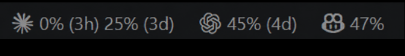
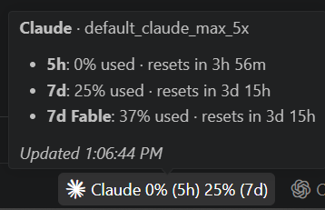
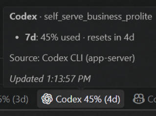
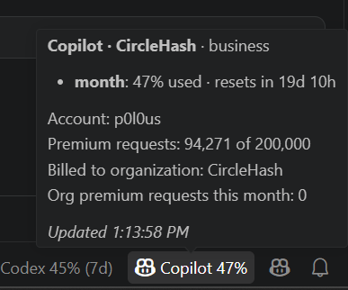
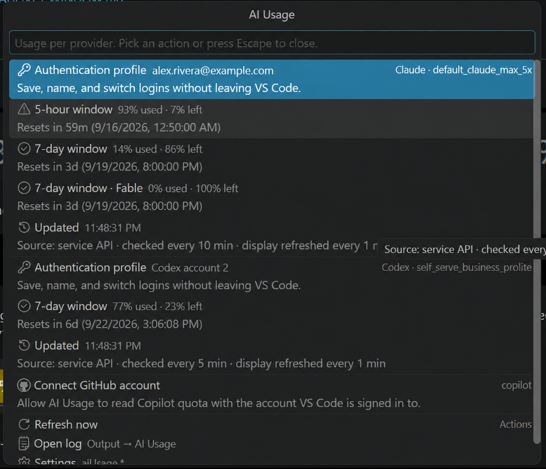

# AI Usage for VS Code

See how much of your AI coding budget is left without leaving the editor. **AI Usage** shows live rate-limit and
quota usage for **Claude Code**, **Codex** and **GitHub Copilot** in the status bar and, in the Agents window, behind
a chip beneath the chat input.

- **Status bar**: `17% (3h) 25% (3d)` for Claude, where parentheses show the time until reset—not the fixed
  quota-window length. The item turns yellow at 80% and red at 95%.
- **Chat chips**: compact percentages such as `Claude 17%` `25%` beneath the chat input for the agent the current
  chat is using; click for the named windows and reset countdowns.
- **Per-chat tokens**: `400k tokens` for the newest Claude or Codex chat in the current workspace; click for the
  exact input, output and cached-input breakdown.
- **Details panel**: click any status bar item or chip for plan, account or organization, reset countdowns and
  source, with Refresh, Open log and Settings actions.
- **Organization aware**: Copilot follows the GitHub account whose Copilot organization owns the workspace
  repository, so org-billed seats show org data.
- **Gentle on the services**: one shared cache for all open windows, per-service check intervals and
  `Retry-After` aware backoff. Codex can be read from the local CLI with no network at all.
- **Honest when things fail**: a failed refresh keeps the previous reading and greys it out after 15 minutes.

Nothing is shown for a tool that is not installed or signed in. Usage checks only read the tools' own login files.
Account keep-alives and automatic profile rotation are optional and disabled by default. Enabling them allows
background model calls, token refresh and, for rotation, native login changes.

With the default icon-only labels, the status bar stays compact while showing each live reset countdown:



Labels are configurable; `iconAndName` adds provider names without changing the usage figures:


High usage is deliberately visible: an item turns yellow at 80% and red at 95%. Here Claude's 92% window resets
in 3 hours while Codex remains neutral at 77%. Countdown labels always use one largest unit (`42m`, `3h`, or
`4d`):


Hover a status item for its named limit windows, plan and reset times. Copilot also identifies the account and,
for organization-billed seats, the organization and its premium-request usage:

| Claude | Codex | Copilot |
|---|---|---|
|  |  |  |

Click a status item or chat chip to open the complete provider breakdown and its profile, refresh, log and settings
actions in one picker:



## Authentication profiles

Run **AI Usage: Manage Claude/Codex Authentication Profiles** from the Command Palette, or open a Claude/Codex
usage item and choose **Accounts**. You can save and name the current login, import a credential JSON
file, and switch among up to 20 profiles per service.

Saved copies live in VS Code `SecretStorage`, not in project files, workspace settings, or the extension's ordinary
global storage. Activating a profile atomically updates the native file already shared by the CLI and vendor
extension (`~/.claude/.credentials.json` / `$CLAUDE_CONFIG_DIR`, or `~/.codex/auth.json` / `$CODEX_HOME`). The file
is forced to mode `0600` on Linux/macOS and inherits the user-profile ACL on Windows. Claude MCP credentials in the
same file are preserved. This native active copy remains plaintext because Claude Code and Codex require that
format; only one selected profile is exposed there at a time.

A convenient setup is: sign in with the CLI, save the current login as a profile, sign in with the next account,
and save again. An imported profile is saved but not activated until you choose it. New requests use a switched
login; an already-running request or agent session may need to finish or be reopened first. In remote development,
profiles belong to the extension host (local, SSH, WSL, or container) where the command is run.

### Account keep-alives and automatic rotation

Open the **AI Usage** menu (click a usage item), then choose **Accounts** under Claude or Codex. This menu lets
you switch accounts manually and enable or disable **Account keep-alive and usage collection** and
**Automatic account rotation** independently for each provider.

- Claude sends `what is date today` using `haiku` every **2 hours** per saved account, in `~/.claude-tmp`.
- Codex sends the same small request every **6 hours** per saved account, using `gpt-5.6-luna` in `~/.codex-tmp`, then
  reads account limits through its CLI. Its model is configurable; an empty model setting uses the CLI default.
- Both collect usage for inactive accounts. The authentication profile list shows each account's last usage,
  check time and errors. Model calls consume subscription usage and run only while this extension host is running.
- Automatic rotation starts when **any** window reaches the service's configured threshold (default **99.5%**),
  including either Codex period. It checks the current account and candidates again, switches to the next account
  below the threshold in **every** reported window,
  and keeps the current login if all accounts are exhausted or unavailable. A failed sweep is throttled until
  the provider's next check interval. Rotation also works without keep-alives enabled.

Models, keep-alive periods, rotation thresholds, CLI paths, dedicated homes and usage sources are configurable
under `aiUsage.claude.*` and `aiUsage.codex.*`; see
[account automation settings](docs/CONFIGURATION.md#account-automation).
Background checks swap credentials only inside the dedicated home, save refreshed tokens back to SecretStorage,
and remove the staged credential file afterward. For a checked active account, refreshed tokens are also written
back to its native login when that login has not changed during the check. Schedules persist across restarts and
checks are coordinated between windows on the same extension host.

### Authentication profile examples

The profile manager marks the current account as **Active** and keeps save, import, rename, and delete actions in
the same quick-pick menu:


After activation, the usage details identify the selected profile and its detected plan:


## Installation

1. In VS Code open the Extensions view (`Ctrl+Shift+X` / `Cmd+Shift+X`), search for **AI Usage**, click **Install**.
   Or install from the command line:

   ```bash
   code --install-extension p0l0us.ai-usage-vscode-plugin
   ```

2. Sign in to the tools you use, if you have not already: run `claude` once, run `codex login` once, and sign in
   to GitHub in VS Code for Copilot.
3. The usage items appear in the status bar within a few seconds. For Copilot, VS Code shows one dialog asking to
   let **AI Usage** use your GitHub account; click **Allow**.

Requires VS Code 1.137 or newer. Works in Cursor and VSCodium from Open VSX.

### Remote development (SSH, WSL, containers, tunnels)

The extension runs **where your AI tools are signed in**. In a Remote-SSH, WSL, dev container or tunnel window
it is installed and runs on the remote machine, so:

- It reads the Claude and Codex logins on the **remote** machine. If you use those CLIs locally instead, they will
  not appear; install the extension locally too, or sign in on the remote side.
- Copilot uses the GitHub account VS Code is signed in with; that works in remote windows as usual.
- Settings for sources and intervals belong in **Remote Settings**, not the local user settings.
- Authentication profiles and their SecretStorage entries belong to that extension host too. A Remote-SSH window
  manages the remote machine's profiles; a normal Windows/macOS/Linux window manages the local machine's profiles.
- The **Agents window** is the exception: it runs only *local* extensions, and blocks extensions with code until
  you allow them. The chip there needs a local install plus a one-time allow step; run
  **AI Usage: Agents Window Setup Guide** from the Command Palette or see
  [docs/AGENTS_WINDOW.md](docs/AGENTS_WINDOW.md).

## Settings you are most likely to touch

| Setting | Default | What it does |
|---|---|---|
| `aiUsage.statusBar.labels` | `iconOnly` | What precedes the figures: `none`, `nameOnly`, `iconOnly` or `iconAndName`. |
| `aiUsage.statusBar.usage` | `rich` | `simple` shows one figure, the most used window, instead of every window. |
| `aiUsage.chatChips.labels` / `.usage` | `name` / `rich` | The same two choices for the chat chips (no icon there). |
| `aiUsage.chatTokens.enabled` | on | Show the local Claude/Codex chat's consumed-token chip. |
| `aiUsage.codex.source` | `cli` | `api` calls the ChatGPT endpoint; `sessionLog` is fully offline. |
| `aiUsage.<service>.checkIntervalMinutes` | 10 / 5 / 5 | How often Claude / Codex / Copilot are queried. |
| `aiUsage.copilot.account` | (auto) | GitHub login to use when several are signed in. |
| `aiUsage.<service>.enabled` | on | Hide a service you do not use. |

The full list is in [docs/CONFIGURATION.md](docs/CONFIGURATION.md). Where the numbers come from, how caching and
backoff work and how the chat chip is built: [docs/INTERNALS.md](docs/INTERNALS.md).

## Troubleshooting

- **A service is missing**: it is not signed in on the machine the extension runs on (see the remote note above).
  **Output → AI Usage** shows what was found.
- **A chat chip shows `n/a`**: the chat's agent is not signed in where the extension runs. In
  the Agents window that is your local computer even for remote sessions; sign in there with the same account
  (`claude` once, or `codex login`) and the figures appear. Do not use `aiUsage.chatChips.debug` for this: it shows
  every service's chip, including Copilot's in a Claude chat.
- **Copilot shows “connect”**: click it and allow access to your GitHub account.
- **Numbers are grey**: the last refresh failed; the tooltip says why. Rate limits clear on their own.

## Contributing

Bug reports, ideas and pull requests from any developer are welcome. Open an issue at
<https://github.com/p0l0us/ai-usage-vscode-plugin/issues> (include the VS Code version and the relevant lines from
**Output → AI Usage**; tokens are never logged) or send a PR. See [CONTRIBUTING.md](CONTRIBUTING.md) for the
workflow and [docs/PUBLISHING.md](docs/PUBLISHING.md) for building, dev-installing and releasing.

Most wanted: additional providers (Gemini CLI, Cursor, …), a Claude source that does not depend on the
undocumented OAuth endpoint, tests.

## License

GPL-3.0-only. See [LICENSE](LICENSE).
