# AI subscription management and usage for VS Code

The extension also bundles an experimental [CLI BYOK bridge](bridge/README.md) that offers your existing
Codex/Claude subscription logins as models in the Copilot model picker. The bridge is still in development and not
fully working yet. Its settings are tagged **Experimental** in the Settings editor, and it can also run standalone
as a local model endpoint.

Run several AI subscriptions without losing track of them. **AI Usage** switches Claude Code and Codex between saved
accounts without signing in again, and shows live rate-limit and quota usage for **Claude Code**, **Codex** and
**GitHub Copilot** in the status bar and, in the Agents window, behind a chip beneath the chat input.

- **Status bar**: `17% (3h) 25% (3d)` for Claude, where parentheses show the time until reset—not the fixed
  quota-window length. The item turns yellow at 80% and red at 95%.
- **Chat chips**: compact percentages such as `Claude 17%` `25%` beneath the chat input for the agent the current
  chat is using; click for the named windows and reset countdowns.
- **Per-chat tokens**: `400k tokens` for the newest Claude or Codex chat in the current workspace; click for the
  exact input, output and cached-input breakdown.
- **Details panel**: click a chat chip or the Copilot status bar item, or choose **Back** in an Accounts menu, for
  plan, account or organization, reset countdowns and source, with Refresh, Open log and Settings actions.
- **Organization aware**: Copilot follows the GitHub account whose Copilot organization owns the workspace
  repository, so org-billed seats show org data.
- **Gentle on the services**: one shared cache for all open windows, per-service check intervals and
  `Retry-After` aware backoff. Codex can be read from the local CLI with no network at all.
- **Honest when things fail**: a failed refresh keeps the previous reading and greys it out after 15 minutes.

Nothing is shown for a tool that is not installed or signed in. Usage checks only read the tools' own login files.
Account keep-alives and automatic profile rotation are optional and disabled by default. Enabling them allows
background model calls, token refresh and, for rotation, native login changes.

With the default icon-only labels, the status bar stays compact while showing each live reset countdown:

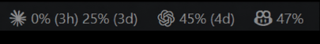

Labels are configurable; `iconAndName` adds provider names without changing the usage figures:


With several saved accounts, the active profile's number in the Accounts list precedes the figures
(`aiUsage.<claude|codex>.statusBar.accountNumber`); here Claude runs on profile 3 and Codex on profile 4:


High usage is deliberately visible: an item turns yellow at 80% and red at 95%. Here Claude's 92% window resets
in 3 hours while Codex remains neutral at 77%. Countdown labels always use one largest unit (`42m`, `3h`, or
`4d`):


Hover a status item for its named limit windows, plan and reset times, the source of the reading and the active
authentication profile. Copilot also identifies the account and, for organization-billed seats, the organization
and its premium-request usage:

| Claude | Codex | Copilot |
|---|---|---|
| 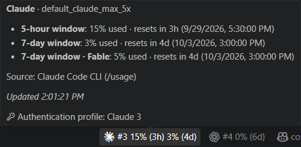 | 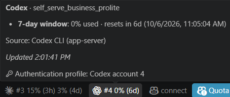 | 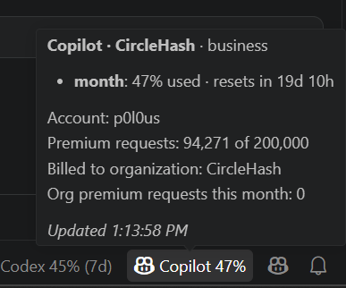 |

Click a chat chip or the Copilot status bar item, or choose **Back** in an Accounts menu, to open the AI Usage menu
of all services: each provider's windows with their reset countdowns, the source of every reading, and the refresh,
log and settings actions in one picker. A service's **Accounts** row opens its Accounts menu:

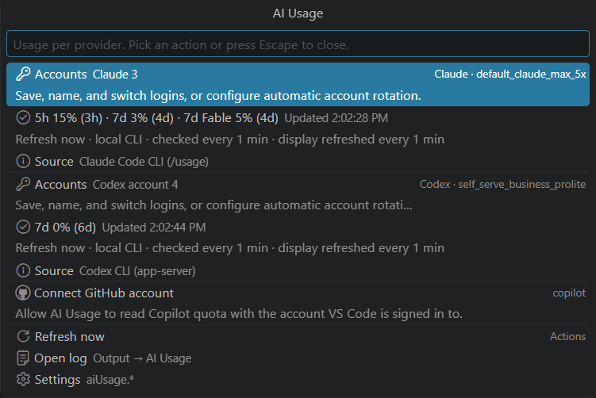

## Authentication profiles

Run **AI Usage: Manage Claude/Codex Authentication Profiles** from the Command Palette, click the Claude or Codex
status bar item, or choose a service's **Accounts** row in the AI Usage menu, to open that service's **Accounts**
menu. You can save and name the current login, import a credential JSON file, export every saved profile to a file
and import it on another computer, and switch among up to 20 profiles per service. A profile is **private**, kept in
this VS Code client's SecretStorage, or a **project** profile, kept with its login in the workspace folder's
`.ai-usage.profiles.json` and listed whenever that folder is open; see
[Private and project profiles](docs/CONFIGURATION.md#private-and-project-profiles). Every saved profile is listed
with its login email, its last usage reading and check time, and the active one is marked:

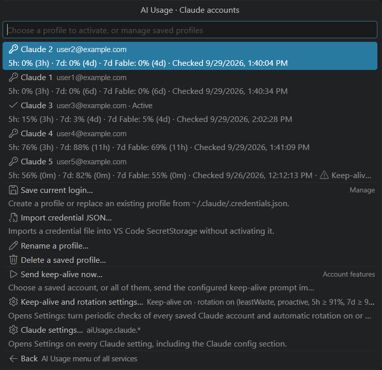

Saved copies live in VS Code `SecretStorage`, not in project files, workspace settings, or the extension's ordinary
global storage. Activating a profile atomically updates the native file already shared by the CLI and vendor
extension (`~/.claude/.credentials.json` / `$CLAUDE_CONFIG_DIR`, or `~/.codex/auth.json` / `$CODEX_HOME`). The file
is forced to mode `0600` on Linux/macOS and inherits the user-profile ACL on Windows. Claude MCP credentials in the
same file are preserved. This native active copy remains plaintext because Claude Code and Codex require that
format; only one selected profile is exposed there at a time. For Claude, activation also updates the token's
account UUID/email in `~/.claude.json` and clears its account-bound caches, so `/status` and `/usage` do not retain
the previous Team member's identity.

A convenient setup is: sign in with the CLI, save the current login as a profile, sign in with the next account,
and save again. An imported profile is saved but not activated until you choose it. Claude reads its credential file
per turn, so open Claude chats and CLI sessions use a switched login from their next turn, with no restart. Codex
keeps its login in memory, so open Codex chats follow a switch only through the optional **Codex account
proxy** (`aiUsage.codex.proxy.enabled`), which routes their requests through AI Usage and attaches the active login
per request; without it, AI Usage offers an extension-host restart. VS Code keeps the saved profiles and their
logins with the VS Code client, the computer in front of you, also in a Remote-SSH, WSL or container window;
activating a profile writes the native credential file of the host that window is connected to.

**Save current login…** offers to create a new profile or to replace one that is already saved, which is also how
a profile whose token has expired is repaired after signing in with that account again:

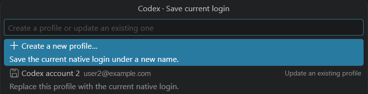

**Export or import saved profiles…** under Manage leads to both. **Export saved profiles…** writes the saved
Claude and Codex profiles, logins included, to a JSON file and opens it in the editor, and **Import saved
profiles…** reads it on another computer: profiles not saved there are added, and a saved profile whose login is missing gets it back. Nothing is activated. The file holds live login tokens in plain text, so delete
it once imported, and mind that a copied login is the same session on both computers; see
[Moving profiles to another computer](docs/CONFIGURATION.md#moving-profiles-to-another-computer).

### Account keep-alives and automatic rotation

Click the Claude or Codex status bar item to open that service's **Accounts** menu (or choose **Accounts** in the
details panel); **Back** leads to the AI Usage menu of all services. This menu lets
you switch accounts manually, save the current login to a new or existing profile, and send a keep-alive on
demand. **Account keep-alive and usage collection** (`aiUsage.<service>.keepAlive.enabled`) and **automatic
account rotation** (`aiUsage.<service>.autoRotate.enabled`) are turned on in Settings, independently per service;
the menu shows what each one is set to.


- Claude sends `what is date today` using `haiku` every **2 hours** per saved account, in `~/.claude-tmp`.
- Codex sends the same small request every **6 hours** per saved account, using `gpt-5.6-luna` in `~/.codex-tmp`, then
  reads account limits through its CLI. Its model is configurable; an empty model setting uses the CLI default.
- Both collect usage for inactive accounts. The authentication profile list shows each account's last usage,
  check time and errors. Model calls consume subscription usage and run only while this extension host is running.
- Automatic rotation switches as soon as the active account's usage reaches a threshold (usage ≥ threshold).
  Claude has two: **95%** for the 5-hour window and **99.5%** for the weekly windows (all models, and `7d Fable` when it
  counts). Codex has one: **99%** for the weekly window; a Codex 5-hour window, when reported, rotates only once it is
  used up. The account switched to must be below the thresholds in every window. Claude picks it with
  `aiUsage.claude.autoRotate.strategy` (soonest weekly reset first by default, or even pace, least waste or saved
  order); Codex uses saved order. When no account is below the thresholds, the current login is kept and a
  notification says so. Rotation also works without keep-alives enabled. Claude can also switch proactively to a
  clearly better account (`aiUsage.claude.autoRotate.trigger`). Details:
  [Rotation strategies and thresholds](docs/CONFIGURATION.md#rotation-strategies-and-thresholds).

Each profile row carries the outcome of its last check: usage per window with the reset countdown, the check time,
and a warning when the keep-alive or the usage check failed. An account whose login failed (expired or revoked) is
marked **Login problem**; choosing it opens a small menu instead of activating it: **Renew the login…** runs the CLI
login in a terminal with a separate home inside the keep-alive home and stores the new login in the profile,
**Try a keep-alive** sends a keep-alive, which refreshes an expired token and, when the login cannot be refreshed,
offers **Sign in again** in its failure notification, **Select anyway** activates the login as it is, and **Back**
returns to the accounts. The same sign-in is available for any profile as **Sign in again…** under Manage; either
way the active login is replaced only when that profile is the active one.


**Usage history.** Every reading of every saved account, every switch (by hand, or by rotation with the accounts it
considered and why it did or did not pick them), the sweeps that switched nothing and the stretches with every
account at its limit are kept for a year in one file per month, so you can see how much of each account you use and
how well rotation works. **AI Usage: Show Usage History…** (also **Usage history** in the details panel) summarizes
a period, with an estimate of how many accounts your weekly use needs, and exports CSV or JSON Lines. Settings:
`aiUsage.history.*`; file format and figures in [Usage history](docs/CONFIGURATION.md#usage-history).

Models, keep-alive periods, rotation thresholds, CLI paths, dedicated homes and usage sources are configurable
under `aiUsage.claude.*` and `aiUsage.codex.*`; see
[account automation settings](docs/CONFIGURATION.md#account-automation).
Background checks swap credentials only inside the dedicated home, save refreshed tokens back to SecretStorage,
and remove the staged credential file afterward. For a checked active account, refreshed tokens are also written
back to its native login when that login has not changed during the check. Schedules persist across restarts and
checks are coordinated between the windows connected to the same host; a check left behind by a window that stopped
responding is taken over after 10 minutes.

### Authentication profile examples

The Codex Accounts menu has the same layout. It marks the current account as **Active** and keeps the save, import,
rename and delete actions, the account features and their settings in the same picker:

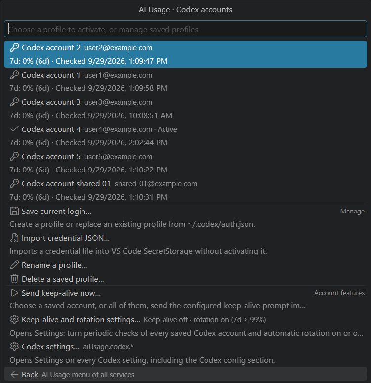

After activation, the AI Usage menu names the selected profile beside **Accounts**, shows its detected plan on the
right, and follows with its usage and the source of the reading:

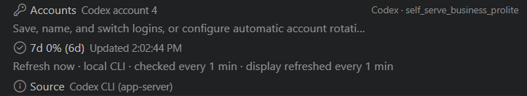

**Back** at the end of an Accounts menu returns to the AI Usage menu of all services:


## Installation

1. In VS Code open the Extensions view (`Ctrl+Shift+X` / `Cmd+Shift+X`), search for **AI Usage**, click **Install**.
   Or install from the command line:

   ```bash
   code --install-extension p0l0us.ai-usage-vscode-plugin
   ```

2. Sign in to the tools you use, if you have not already: run `claude` once, run `codex login` once, and sign in
   to GitHub in VS Code for Copilot.
3. The usage items appear in the status bar within a few seconds. For Copilot, VS Code shows one dialog asking to
   let **AI Usage** use your GitHub account; click **Allow**.

Requires VS Code 1.137 or newer. Works in Cursor and VSCodium from Open VSX.

### Remote development (SSH, WSL, containers, tunnels)

The extension runs **where your AI tools are signed in**. In a Remote-SSH, WSL, dev container or tunnel window
it is installed and runs on the remote machine, so:

- It reads the Claude and Codex logins on the **remote** machine. If you use those CLIs locally instead, they will
  not appear; install the extension locally too, or sign in on the remote side.
- Copilot uses the GitHub account VS Code is signed in with; that works in remote windows as usual.
- Settings for sources and intervals belong in **Remote Settings**, not the local user settings.
- Authentication profiles and their SecretStorage entries belong to that extension host too. A Remote-SSH window
  manages the remote machine's profiles; a normal Windows/macOS/Linux window manages the local machine's profiles.
- The **Agents window** is the exception: it runs only *local* extensions, and blocks extensions with code until
  you allow them. The chip there needs a local install plus a one-time allow step; run
  **AI Usage: Agents Window Setup Guide** from the Command Palette or see
  [docs/AGENTS_WINDOW.md](docs/AGENTS_WINDOW.md).

## Settings you are most likely to touch

| Setting | Default | What it does |
|---|---|---|
| `aiUsage.statusBar.labels` | `iconOnly` | What precedes the figures: `none`, `nameOnly`, `iconOnly` or `iconAndName`. |
| `aiUsage.statusBar.usage` | `rich` | `simple` shows one figure, the most used window, instead of every window. |
| `aiUsage.<claude\|codex>.statusBar.accountNumber` | `true` | Show the active saved profile's number (`#2`) between the icon and the figures, when several are saved. |
| `aiUsage.chatChips.labels` / `.usage` | `name` / `rich` | The same two choices for the chat chips (no icon there). |
| `aiUsage.chatTokens.enabled` | on | Show the local Claude/Codex chat's consumed-token chip. |
| `aiUsage.<service>.source` | `both` | Local file first (Claude's account file, Codex's session logs), service endpoint when that reading goes stale. |
| `aiUsage.<service>.checkIntervalMinutes` | 10 / 5 / 5 | How often Claude / Codex / Copilot are queried. Claude accepts fractions down to 0.25 (15 s). |
| `aiUsage.copilot.account` | (auto) | GitHub login to use when several are signed in. |
| `aiUsage.<service>.enabled` | on | Hide a service you do not use. |

The full list is in [docs/CONFIGURATION.md](docs/CONFIGURATION.md). Where the numbers come from, how caching and
backoff work and how the chat chip is built: [docs/INTERNALS.md](docs/INTERNALS.md).

## Troubleshooting

- **A service is missing**: it is not signed in on the machine the extension runs on (see the remote note above).
  **Output → AI Usage** shows what was found; **Open log** in the AI Usage menu opens it:

  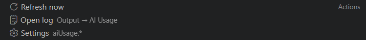

- **A chat chip shows `n/a`**: the chat's agent is not signed in where the extension runs. In
  the Agents window that is your local computer even for remote sessions; sign in there with the same account
  (`claude` once, or `codex login`) and the figures appear. Do not use `aiUsage.chatChips.debug` for this: it shows
  every service's chip, including Copilot's in a Claude chat.
- **Copilot shows “connect”**: click it and allow access to your GitHub account. The AI Usage menu offers the same
  action:

  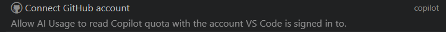

- **Numbers are grey**: the last refresh failed; the tooltip says why. Rate limits clear on their own.

## Contributing

Bug reports, ideas and pull requests from any developer are welcome. Open an issue at
<https://github.com/p0l0us/ai-usage-vscode-plugin/issues> (include the VS Code version and the relevant lines from
**Output → AI Usage**; tokens are never logged) or send a PR. See [CONTRIBUTING.md](CONTRIBUTING.md) for the
workflow and [docs/PUBLISHING.md](docs/PUBLISHING.md) for building, dev-installing and releasing.

Most wanted: additional providers (Gemini CLI, Cursor, …), a Claude source that does not depend on the
undocumented OAuth endpoint, tests.

## License

GPL-3.0-only. See [LICENSE](LICENSE).
