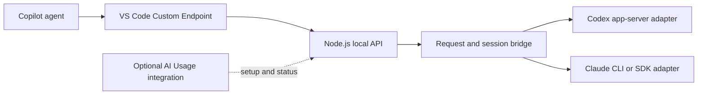

# CLI-to-Copilot BYOK bridge proposal

Implementation follow-up: this branch now includes the experimental standalone [CLI BYOK Bridge](../bridge/README.md), with both adapters and live HTTP tool-round-trip checks. The investigation below records the original design; the bridge README describes the implemented scope and remaining limits.

Investigated 2026-09-16. This is a design proposal, not a working bridge. Scope: keep Copilot's agent, context assembly, tools, approvals, and edit experience while sourcing inference through a local Claude/Codex runtime. Node.js on Linux/macOS/Windows is the preferred implementation. Subscription-backed CLI authentication is required; separately billed provider API keys are excluded.

**Recommendation:** build a standalone TypeScript/Node.js bridge exposing an OpenAI-compatible local endpoint. Start with a Codex adapter and prove the tool-call round trip before building management UI. Add an optional integration in AI Usage afterwards. Treat Claude support as a separate technical and authentication decision.

**Available integration points**

VS Code's Custom Endpoint provider accepts Chat Completions, Responses, and Messages APIs. Agent models must support tool calling. A local endpoint can therefore appear in the normal model picker without modifying VS Code. BYOK covers chat and utility tasks; it does not replace inline completion or embedding features. [VS Code model configuration](https://code.visualstudio.com/docs/agent-customization/language-models)

An extension can alternatively register `LanguageModelChatProvider`, advertise models, estimate tokens, and stream text and tool-call parts. The installed VS Code type definitions also confirm that the caller executes requested tools and submits results in a subsequent model request. [Provider API](https://code.visualstudio.com/api/extension-guides/ai/language-model-chat-provider)

| Approach | Fits standard BYOK? | Assessment |
| --- | --- | --- |
| Node.js local API + CLI adapters | Yes, if tool semantics are preserved | Recommended first interface; portable and usable by other clients. |
| Native model-provider extension | Yes, with the same backend work | Useful optional frontend; eliminates manual endpoint setup. |
| Direct Anthropic/OpenAI API keys | Yes, already supported | Excluded by the subscription-only requirement. |
| MCP tools such as `ask_codex` / `ask_claude` | Delegation only | Useful alternative, but Copilot still needs its own main model. |
| Native Claude/Codex agent sessions in VS Code | Different agent harness | Existing alternative if the common UI matters more than retaining Copilot's agent loop. |
| Patch VS Code or vendor extensions | Potentially | High maintenance; no advantage for the public model-provider interface. |
| Fork the Codex runtime | Potentially | Fallback investigation only if essential model/tool controls are unavailable in the public protocol. |
| Replay subscription tokens against private model endpoints | Technically brittle | Do not base the product on this; use the runtime's supported authentication. |

VS Code already documents Claude and Codex harness integrations, including provider credentials. Their availability does not imply that another extension can use them as raw model APIs. I found no documented general-purpose model API exported by the vendor extensions in the pages reviewed. [VS Code agent harnesses](https://code.visualstudio.com/docs/agents/run/agent-harnesses), [Claude extension](https://code.claude.com/docs/en/vs-code), [Codex extension](https://learn.chatgpt.com/docs/codex/ide)

**Proposed architecture**

Suggested packages are `bridge-core`, `bridge-server`, `adapter-codex`, and later `adapter-claude`. Keep VS Code imports out of the core. Start with `GET /v1/models` and streaming/non-streaming `POST /v1/chat/completions`; implement the subset actually exercised by Copilot and reject unsupported parameters explicitly. Responses support can follow after interoperability tests.

Use loopback binding and a generated local bearer secret. The secret protects the bridge; it is not a provider API key and creates no separate provider API billing. Each backend uses the user's own existing native subscription login and handles credential refresh. Detect an API-key-backed CLI configuration and report that it does not satisfy subscription mode instead of silently using it. Launch child processes with argument arrays and pipe structured data over stdin. Resolve Windows executable/npm launchers explicitly and test process-tree termination on Windows as well as Unix. Run on the host where the CLI and login exist; WSL, Remote-SSH, and containers require an explicit endpoint/host arrangement.

**The central problem: preserving Copilot's tool loop**

`claude -p` and `codex exec` are agent invocations. Streaming their final text does not automatically implement a model provider. The bridge must implement this proposed exchange:

1. Receive Copilot's messages, instructions, tool schemas, and model options.
2. Expose only the intended tools to the backend and prevent independent workspace actions.
3. Translate a backend tool request to an API `tool_calls` response; finish that HTTP response while retaining the backend's suspended call.
4. Let Copilot perform its normal approval and execute the tool.
5. Correlate the next request's tool result with the suspended call, deliver it to the backend, and stream the continuation.

Waiting for the backend's entire agent turn before returning step 3 would deadlock. Executing the tools inside the bridge would change the ownership and approval model.

Maintain opaque bridge-generated call IDs mapped to backend request IDs, account, model, and conversation state. Never use one global “current conversation.” Preserve roles, tool arguments/results, and the tool-selection mode. Handle concurrent chats, retries, denied tools, repeated tool names, multiple calls, cancellation, and abandoned continuations. Keep suspended processes only for a bounded period; do not kill them merely because a tool-call HTTP response completed normally.

Do not assume the standard provider API supplies a stable chat-session ID: the installed `ProvideLanguageModelChatResponseOptions` does not. Pending tool IDs are suitable for active continuations. For independent user turns, reconstruct history or use rigorously matched state. Compaction, edited messages, changed tool schemas, and branching must invalidate incompatible state. A cache keyed only by prompt text is insufficient.

**Codex adapter: first feasibility target**

The app server supports managed ChatGPT authentication, model discovery, streamed turns, and experimental dynamic tools with client-side results. Its documentation also describes injecting conversation items. These are useful building blocks, but do not constitute a ready-made Chat Completions endpoint. [Codex app-server protocol](https://learn.chatgpt.com/docs/app-server)

Local verification: `codex-cli 0.151.0` is installed. Generated experimental TypeScript schemas confirm `dynamicTools`, `baseInstructions`, `developerInstructions`, `ephemeral`, `thread/inject_items`, and the dynamic-tool request/response types. The schema generation made no inference requests.

Prototype the suspended-call exchange first. Preserve native role/tool history where possible; do not flatten the transcript into a user prompt. Validate history injection, prompt changes, tool-set changes, and server-request lifetime against the pinned CLI version. Disable inherited MCP, plugins, hooks, background agents, and runtime tools through supported controls wherever available. Shell feature controls exist, but I have not established one public switch that removes every built-in tool. Read-only filesystem access alone does not prevent independent reads, commands, or network tools. This is a release gate, not a solved detail. [Codex configuration](https://learn.chatgpt.com/docs/config-file/config-reference)

If complete tool isolation or faithful history transfer cannot be achieved, do not advertise full Agent compatibility. Investigate a narrow Codex runtime change that preserves native authentication and exposes the required tool boundary. Structured-output emulation of tool calls is another possible experiment, but loses native tool semantics and must not be described as equivalent without evaluation. There is no fallback to separately billed API inference.

**Claude adapter: separate feasibility target**

Claude's CLI supports structured streaming; its Agent SDK supports custom tools through MCP. A proposed adapter could expose Copilot tools as MCP callbacks, suspend those callbacks, and resolve them from later Copilot results. This needs an actual continuation test; observing tool events alone is insufficient. [CLI automation](https://code.claude.com/docs/en/headless), [SDK custom tools](https://code.claude.com/docs/en/agent-sdk/custom-tools)

Authentication requires care in product design. Anthropic distinguishes users signing into an unmodified Claude Code binary from third-party products offering Claude login or routing users' subscription credentials. The former is expressly contemplated; the latter is restricted. SDK guidance directs third-party products to API keys unless approved. Therefore, a personal CLI wrapper and a distributed subscription-backed model proxy cannot be assumed equivalent. For this subscription-only project, investigate the unmodified local CLI with native user sign-in; do not collect or replay subscription tokens. Whether this exact bridge can be distributed under those conditions remains unresolved. If that route is unavailable, report Claude support as unavailable rather than substitute paid API access. [Credential and product conditions](https://code.claude.com/docs/en/legal-and-compliance), [SDK authentication guidance](https://code.claude.com/docs/en/agent-sdk/overview)

The installed CLI is `2.1.273`. Its `--bare` mode skips OAuth/keychain authentication, so it cannot simply be selected as an isolation flag while expecting subscription login to continue working. CLI isolation, available tools, and authentication must be tested together.

**Fit with this repository**

`src/live.ts` already resolves the Codex executable and implements a short-lived app-server request for rate limits. Extract the useful transport concepts into the new core, but implement full request routing, notifications, cancellation, and server-to-client requests: the existing two-request helper is insufficient.

`src/authProfiles.ts` provides account labels and activation hooks. Initially bind requests to the existing active CLI login. Profile changes should drain/cancel old workers and start fresh workers; do not silently change accounts during a tool continuation. Avoid concurrently switching the shared native credential file per request. Claude distribution should use native sign-in rather than extending credential collection.

The optional AI Usage frontend can start/stop the server, register a native provider later, show backend health, and surface usage. Current chip matching follows the agent harness; a Copilot session using a Codex bridge would need explicit billing-backend attribution rather than assuming “Copilot session means Copilot usage.” Bridge sessions also should not depend on the current “newest workspace session” token heuristic.

**Implementation sequence and acceptance criteria**

1. Prove Codex text streaming, one Copilot tool call, real Copilot execution, result continuation, and final answer. Also prove backend tools cannot independently act.
2. Add local HTTP compatibility and configure a real VS Code Custom Endpoint. Verify read → edit → test with native approvals, then two simultaneous chats, denied calls, cancellation, and history compaction.
3. Add Windows process support, pinned protocol compatibility checks, bounded worker lifecycle, account-change handling, accurate errors, and token accounting. Report estimates separately from measured usage; do not advertise vision or tool capabilities before testing them.
4. Add AI Usage management integration. Test the ordinary Chat view first; Agent Host BYOK is separately experimental behind `chat.agentHost.byokModels.enabled`. [VS Code model configuration](https://code.visualstudio.com/docs/agent-customization/language-models)
5. Evaluate Claude callback/history behavior and permitted authentication, then implement that adapter if the results support the intended product.

No extension behavior or credentials were changed during this investigation. No inference round trip has been tested, so compatibility remains a hypothesis with explicit acceptance gates.
