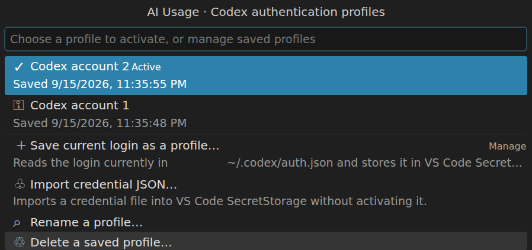
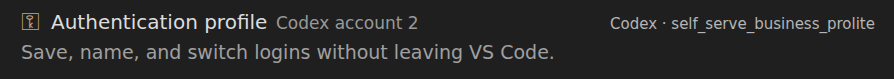

# Configuration reference

All options live under **AI Usage** in the Settings editor (`Ctrl+,` / `Cmd+,`, then search *AI Usage*) and start
with `aiUsage.` in `settings.json`. In a Remote-SSH, WSL or container window, **Preferences: Open Remote Settings**
lets you override options for that host. Machine-specific paths and connection settings appear only in the
Remote tab there; feature switches also appear in the User tab.

## Sources

Each service has a `source` setting that selects where its usage is read from:

| Setting | Options | Default | Notes |
|---|---|---|---|
| `aiUsage.claude.source` | `both`, `cli`, `api`, `accountFile` | `both` | `cli` runs Claude Code's own `/usage` (set `aiUsage.claude.cliPath` if it is not on PATH): no model is called and nothing is billed, but Claude Code reaches the usage endpoint to answer it, so it is spaced like `api`. `accountFile` reads the usage Claude Code itself cached in `~/.claude.json` — no network call, so it can be polled every few seconds (`aiUsage.claude.accountFile.checkIntervalSeconds`), but it is only as fresh as Claude Code's own last request, and Claude Code drops that cache on an account switch until something asks it for usage again. |
| `aiUsage.codex.source` | `both`, `cli`, `api`, `sessionLog` | `both` | `cli` runs `codex app-server` (set `aiUsage.codex.cliPath` if it is not on PATH). `sessionLog` is offline but only as fresh as your last Codex turn. |
| `aiUsage.copilot.source` | `api` | `api` | The Copilot CLI has no headless usage command. |

`both` combines the two: the local file is re-read on every check and used while its reading is no older than that
service's `checkIntervalMinutes`; once it falls behind, because the CLI has been idle or has never written one, the
service endpoint fills the gap, called no more often than the `api` source would call it. Usage therefore follows an
active CLI session within seconds without spending more of the service's rate limit, and keeps updating when no
session is running.

## Copilot CLI sessions

Open **Settings → Extensions → AI Usage → Copilot CLI bridge (experimental)** for the CLI bridge options, including
separate **Codex** and **Claude** controls for persistent sessions, opening in the CLI, and plugin links.
You can also search Settings for `@ext:p0l0us.ai-usage-vscode-plugin aiUsage.bridge`.

| Setting (`<provider>` is `codex` or `claude`) | Default | Purpose |
| --- | --- | --- |
| `aiUsage.bridge.<provider>.persistSessions` | `false` | Save new sessions in native CLI history so they can be reopened later. |
| `aiUsage.bridge.<provider>.openInCli` | `false` | Show an Open in CLI link and copyable resume command above the answer once the native session starts. |
| `aiUsage.bridge.<provider>.openInExtension` | `false` | Show an Open in Codex/Claude Code chat link above the answer, targeting that exact saved session. |
| `aiUsage.bridge.<provider>.sessionDirectory` | Empty | Workspace directory for saved sessions; empty uses the current single workspace folder, falling back to `~/.cli-byok-bridge/workspaces/<provider>`. |

Enable **Persist Sessions** before starting a new conversation. When using an **AI Usage CLI Bridge**
model in Copilot, the enabled controls appear above the answer as soon as the native session ID is
available, without HTML markers. The command includes the session's working directory and can be
copied into a terminal on the extension host. Links route back to this host, check the exact session,
and prefer the native sidebar; Claude uses its session-opening command rather than its editor-only URL.
Opening Claude also selects its sidebar preference. Claude requires the session workspace to be open
in VS Code. Open after the response completes and the native worker is released; an early click explains
that the session is still running. Tool continuations do not repeat the header. Existing replies are not
retroactively updated. **AI Usage: Inspect CLI Sessions** remains available for metadata and opening actions.
These options apply to the extension
host. The feature switches appear in **User** settings even in an SSH/WSL/container window, with
host-specific overrides available in **Remote** settings. Connection settings, CLI executable paths,
and session directories remain machine-specific: use the **Remote** tab for those in remote windows.
Bridge settings are excluded from Settings Sync by default. The existing
`aiUsage.bridge.*` setting keys remain unchanged. Model discovery, bridge startup, connection, and
CLI executable settings are in the same Copilot CLI bridge section. See the [bridge guide](../bridge/README.md)
for details.

## Intervals

- `aiUsage.<service>.checkIntervalMinutes` (Claude 10, Codex 5, Copilot 5): how often that service's source is
  called and the result stored in the shared on-disk cache. One call serves every open window.
- `aiUsage.updateIntervalMinutes` (1): how often every window re-reads the cache and redraws the status bar and
  chat chip details. Applies to all sources.
- Manual **AI Usage: Refresh**, and clicking a service's usage row in the details panel, bypass the check interval
  but still honour a shared backoff after a rate-limit or server error (`Retry-After` when sent, otherwise 1 to
  30 minutes doubling) and, for Claude, the call budget below.
- `aiUsage.claude.api.minIntervalSeconds` (30): the smallest gap between two calls to Anthropic's usage endpoint,
  counted across all open windows, every saved account and manual refreshes. Anthropic rate-limits this endpoint
  and does not document the limit, so the extension also adopts a stricter spacing when a response advertises one
  (`anthropic-ratelimit-requests-remaining`/`-reset`, or `Retry-After`): whatever quota a response reports is
  spread over the rest of its window. A refresh that arrives too early shows the cached reading and says when the
  next call is due. `0` leaves only the service's own limits.

## Other settings

- `aiUsage.statusBar.enabled` (default on): show the usage items in the status bar at all.
- `aiUsage.statusBar.labels`: what precedes the figures in a status bar item: `none` (figures only), `nameOnly`,
  `iconOnly` (default) or `iconAndName`.
- `aiUsage.statusBar.usage`: `rich` (default) shows every window, `17% (3h) 25% (3d)`; the value in parentheses
  is time until reset, reduced to one largest unit (`42m`, `3h`, or `4d`). `simple` shows only the most-used window.
- `aiUsage.claude.statusBar.accountNumber` / `aiUsage.codex.statusBar.accountNumber` (default `true`): put the
  active saved profile's position in the Accounts list between the icon and the figures, e.g. `#2 17% (3h)` after the Claude icon.
  Shown only when the service has at least two saved profiles and the active login is one of them.
- `aiUsage.chatChips.labels`: `name` (default) prefixes the first chip with the service name, `Claude 4%`;
  `none` shows figures only. Chips cannot carry the vendor icon: VS Code drops the text of a toolbar item that has
  an icon.
- `aiUsage.chatChips.usage`: `rich` (default) shows one percentage chip per window, `Claude 4%` `26%`; `simple`
  shows the most-used window only, `Claude 26%`. Click a chip to see window names and reset countdowns. Copilot has
  a single monthly window, so both modes look the same for it.
- `aiUsage.chatChips.workbench`: `whenNoStatusBar` (default) shows the chip in a regular VS Code window only when no status bar shows the same figures; `always` or `never` override that. The Agents window has no status bar, so the chip there follows `aiUsage.chatChips.agentsWindow`.
- `aiUsage.claude.enabled` / `aiUsage.codex.enabled` / `aiUsage.copilot.enabled`: toggle the live items (default on).
- `aiUsage.copilot.account`: GitHub login to use when several are signed in.
- `aiUsage.chatChips.enabled`: toggle the chips beneath the chat input (default on). Clicking a chip opens the
  details panel for that agent. Hovering a chip only repeats its text; VS Code offers extensions no richer tooltip
  on that toolbar.
- `aiUsage.chatTokens.enabled`: show the consumed-token chip for the newest local Claude or Codex session in the
  current workspace (default on). Its compact value is rounded; clicking it shows exact input, output and cached
  input counts. VS Code does not expose another extension's active chat id, so if several chats run concurrently,
  the most recently updated matching session is shown. Copilot's per-chat telemetry is not available to extensions.
- `aiUsage.chatChips.agentsWindow`: also show the chip in the Agents window (default on; see
  [Agents (sessions) window](AGENTS_WINDOW.md) for the required one-time setup). The extension there runs
  on your local computer and shows the logins found there, also for remote sessions; a chat whose agent is not signed in
  locally gets an `n/a` chip.
- `aiUsage.chatChips.debug` (default off): diagnostic. Adds a test chip and shows every service's chip regardless
  of the chat's agent (Copilot's in a Claude chat, for example). Not needed to enable the chip.
- `aiUsage.accounts`: optional manual figures; the `AI xx%` item appears only when set.

## Claude and Codex authentication profiles

Authentication profiles are commands, not settings, because credentials must never appear in `settings.json`.
Run **AI Usage: Manage Claude/Codex Authentication Profiles** to save the current native login, import a credential
JSON file, rename/delete profiles, or activate one of up to 20 profiles per service. Profile names and the selected
profile id are non-secret extension metadata; credential bodies are stored individually in VS Code
`SecretStorage`.

Each saved profile shows the login email beside its name, so the same account saved twice is easy to spot. Codex
emails come from the saved id token; Claude credentials carry no identity, so the email is read from the Claude
OAuth profile endpoint (or the local Claude Code account file when offline) when a login is saved, replaced or
refreshed, and once for older profiles when the menu opens. The email is stored with the profile name as non-secret
metadata.

The profile manager shows the active account alongside the available management actions:

The details view confirms which profile is active and shows its detected plan:

Switching updates the same provider-native credential file used by its CLI and VS Code extension. The write uses
an atomic replacement; its temporary and resulting file use mode `0600` on Linux/macOS and the containing
user-profile directory's ACL on Windows. For Claude only the `claudeAiOauth` object is replaced, so `mcpOAuth.*`
entries remain untouched. Codex `auth.json` is replaced as a unit. When the native active login can be matched
safely to its saved profile (Codex account id, Claude organization, or an identical refresh token), refreshed token data
is captured before switching away. If a saved profile stops working with "Login token expired", log in with that
account natively and use **Save current login** to replace the profile.

### What happens to running Codex sessions

A switch replaces `auth.json`, and every Codex process started afterwards, such as `codex` in a new terminal, uses
the new login. Processes that were already running do not: Codex keeps its login in memory, notices on its next turn
that the file changed underneath it and fails that turn with *"signed in to another account"* rather than adopting
the new credentials (verified against Codex 0.154.0). The Codex VS Code extension starts its `app-server` once and
never respawns it, VS Code cannot restart a single extension, and the extension's own recovery path is a full window
reload. AI Usage offers two ways out.

**Codex account proxy** (`aiUsage.codex.proxy.enabled`, experimental, off by default). AI Usage starts a small HTTP
server on `127.0.0.1:43117` (`aiUsage.codex.proxy.port`) and adds a `model_providers.ai-usage` entry to Codex's
`config.toml`, selected as `model_provider`. Codex re-reads that file whenever a chat starts, so from the next new
chat on, the Codex extension and the CLI send their model requests to the proxy without credentials; the proxy reads
`auth.json` *for every request*, attaches the active login and forwards the request unchanged: ChatGPT logins to
`chatgpt.com/backend-api/codex`, API keys to `api.openai.com`. A switch therefore reaches every chat on the proxy
on its next turn, and nothing is restarted. What changes for you: Codex's own account panel shows no login while the
provider is selected (the AI Usage status bar keeps showing the usage), Codex's `/status` reports
`Rate limit: Unavailable` until the chat's first turn — it reads limits from a login the app-server no longer knows,
and only learns them again from the rate-limit data the proxy passes back with each model response (verified with a
proxied turn on 0.155.0) — chats opened before the proxy was enabled keep their previous path until you start a new
chat, and failed Codex model requests are noted in the AI Usage log. One
AI Usage window serves the port and the others share it; when the serving window closes, the provider entry is
removed until another window takes the port over (within a minute), and turning the setting off restores
`config.toml` to what it was. Only the managed block between two marker comments and the `model_provider` line are
touched. AI Usage's own usage checks pin `model_provider = "openai"` and are unaffected. The proxy answers only
requests addressed to `127.0.0.1` that carry a token it writes into `config.toml`, so a web page on the same machine
cannot use the login through it; anything that can read `auth.json` could use the login anyway. When the ChatGPT
backend answers 401, the proxy asks Codex itself to refresh the tokens once (a fresh `codex app-server` on the
native home rewrites `auth.json`) and retries.

**Restart hint** (while the proxy is off). AI Usage always says so in the switch message. Set
`aiUsage.codex.switchRestartHint` to `true` and, in each window whose Codex process predates the switch, it also
shows one warning per switch with a **Restart extensions** action. That restarts only that window's extension host;
editors and terminals stay open and Codex chats reopen from their local session files. Nothing is killed and nothing
restarts by itself. The warning is off by default because it interrupts every window holding an older Codex
process.

Right after the write, AI Usage starts a fresh `codex app-server` on the native home and checks that the login it
reports (`getAuthStatus`, falling back to `account/read`) is the activated profile. A mismatch is shown as an error
instead of the success message; the previous `auth.json` remains recoverable from its saved profile because refreshed
tokens are captured before every switch.

**Never save one login twice.** Both vendors rotate the refresh token on every refresh. Two saved profiles of the same
account are refreshed independently by the keep-alive and by switching, so one of them eventually reuses a rotated
refresh token, and the provider then revokes the whole login (`token_revoked`); only a fresh `codex login` or
`claude` sign-in repairs that. AI Usage shows each profile's email, marks duplicates in the menu and warns before
saving a login whose email is already saved.

Claude profile activation also synchronizes `~/.claude.json` from the activated OAuth token so Claude's `/status`,
`/usage`, account UUID and cached usage do not stay attached to another member of the same Team. If Anthropic's
profile endpoint cannot be reached (it rate-limits per account), the switch still happens, the previous account's
identity is cleared rather than left on display, the notification says the login could not be confirmed, and AI Usage
keeps retrying in the background until `/status` agrees with the switch. Claude Code reads its credential file per
turn, so open Claude chats and CLI sessions follow a switch from their next turn; no restart or window reload is
needed. (Codex is different and does need one — see `aiUsage.codex.switchRestartHint` above.)

If you would rather keep two accounts side by side than switch one home, start a VS Code window with
`CODEX_HOME=~/.codex-<account>`: the Codex extension resolves its home from that variable and AI Usage follows it
for reading usage and for its profile commands, so the two windows stay independent.

The extension is workspace-first. In Remote-SSH, WSL, and dev-container windows it runs remotely and manages that
host's native credential files and SecretStorage. In an ordinary Windows/macOS/Linux window it runs locally. These
stores are intentionally separate; remote profiles do not leak into the local workstation or vice versa.

The active native credential is necessarily still plaintext and readable by processes running as your OS user.
SecretStorage protects the inactive saved copies from project files and ordinary extension storage; it does not
change the security model of the vendor CLI. Credential files selected with **Import** are not deleted by the
extension.

### High-usage highlighting

Status-bar items turn yellow when any displayed window reaches 80% usage and red at 95%. In this example Claude's
92% window resets in 3 hours, so Claude is highlighted while Codex remains neutral at 77%:

## Claude Code config

The **Claude Code config** settings section sets how many agents Claude Code runs at once, through environment
variables in the `env` object of Claude Code's user settings (`settings.json` in `$CLAUDE_CONFIG_DIR`, default
`~/.claude`):

| Setting | `settings.json` entry | Claude Code default |
|---|---|---|
| `aiUsage.claudeConfig.env.maxConcurrentSubagents` | `env.CLAUDE_CODE_MAX_CONCURRENT_SUBAGENTS` (Claude Code 2.1.217+) | 20 |
| `aiUsage.claudeConfig.env.workflowMaxConcurrentAgents` | `env.CLAUDE_CODE_WORKFLOW_MAX_CONCURRENT_AGENTS` (Claude Code 2.1.269+, at most 256) | 16, fewer on machines with few CPUs |

Every setting defaults to empty (`null`), which leaves the file alone. A set value is written as a string when
AI Usage starts and whenever the setting changes. Claude Code reads it when a session starts, so running sessions
keep the old value until they are restarted. Other keys and `env` entries are kept, and the file is written with
its own indentation. A file that is not valid JSON is not touched, and the problem is noted in the AI Usage log.
Clearing a setting later does not remove the value from the file. The project `.claude/settings.json` is never
changed. A higher cap does not raise the account's usage limit, so more parallel agents reach it sooner.

## Codex config

The **Codex config** settings section sets a few keys of Codex's own `config.toml` in the Codex home
(`$CODEX_HOME`, default `~/.codex`), so they can be changed from VS Code settings (and synced with them) instead of
by editing the file:

| Setting | `config.toml` key |
|---|---|
| `aiUsage.codexConfig.agents.maxConcurrentThreadsPerSession` | `[agents] max_concurrent_threads_per_session` |
| `aiUsage.codexConfig.agents.maxDepth` | `[agents] max_depth` |
| `aiUsage.codexConfig.agents.jobMaxRuntimeSeconds` | `[agents] job_max_runtime_seconds` |

Every setting defaults to empty (`null`), which leaves the file alone. A set value is written when AI Usage starts
and whenever the setting changes; Codex reads `config.toml` when a chat starts, so chats started afterwards use it.
Only that one `key = value` line changes (a trailing comment on it is kept, the rest of the file is untouched); a
missing `[agents]` table is added, and a root-level `agents.<key> = …` line is updated in place. Clearing a setting
later does not remove the value from the file, and a manual edit of the key is overwritten the next time AI Usage
starts while the setting is set. Invalid values and an `agents = { … }` inline table are skipped and noted in the
AI Usage log.

## Account automation

Save or import each subscription login in **AI Usage: Manage Claude/Codex Authentication Profiles**. Under each
provider's **Accounts** menu you can switch accounts manually and send a keep-alive on demand; both features are
turned on in Settings, per provider, and default to off. The menu shows their current state and links to Settings.

| Setting suffix (`aiUsage.claude.` / `aiUsage.codex.`) | Claude default | Codex default | Purpose |
| --- | --- | --- | --- |
| `keepAlive.enabled` | `false` | `false` | Periodically check every saved account, including inactive ones. |
| `autoRotate.enabled` | `false` | `false` | Switch accounts automatically once the active one reaches a threshold. |
| `keepAlive.periodHours` | `2` | `6` | Per-account keep-alive period, minimum 0.25 hours. |
| `autoRotate.fiveHourThresholdPercent` | `95` | — (fixed at 100) | Threshold for the 5h window. |
| `autoRotate.weeklyThresholdPercent` | `99.5` | `99` | Threshold for the weekly windows (`7d`, and `7d Fable` when it counts). |
| `autoRotate.modelLimits` | `auto` | — | Whether `7d Fable` counts: `auto` (when Claude Code's `model` is Fable or unset), `always`, `never`. |
| `autoRotate.strategy` | `soonestReset` | — | How the next account is chosen: `soonestReset`, `evenPace`, `leastWaste` or `sequential`. |
| `autoRotate.trigger` | `limit` | — | `limit` switches only at a threshold; `proactive` also switches to a clearly better account. |
| `autoRotate.minStayMinutes` | `30` | — | With `proactive`, how long a newly active account is kept before another proactive switch. |
| `keepAlive.home` | `~/.claude-tmp` | `~/.codex-tmp` | Dedicated CLI home; must be separate from the native home. |
| `keepAlive.model` | `haiku` | `gpt-5.6-luna` | Select a subscription model for the small request. |
| `cliPath` | `claude` | `codex` | CLI command or executable path. |

Codex defaults to Luna for small background calls, following [OpenAI Docs model usage guidance](https://learn.chatgpt.com/docs/pricing).
Use a model available to your subscription; an empty Codex model setting selects the CLI default.

Every keep-alive asks exactly `what is date today`. Requests use a separate working directory and CLI home,
with inherited authentication and provider routing overrides removed. Claude tools and custom hooks are disabled;
Codex runs noninteractively with a read-only sandbox. A keep-alive has a 90-second timeout. The extension attempts
to collect usage even if the small model call fails. Claude uses the OAuth usage endpoint, and Codex uses
`account/rateLimits/read` through its app-server with the same staged login. Codex API-key-only profiles do not
expose subscription quota windows and cannot qualify as automatic rotation targets.

The configurable home is dedicated to this feature. Relative paths resolve from the OS user home, and `~/` is
expanded. Credentials are staged using an atomic write with mode 0600 on POSIX and removed after the check.
The CLI may retain its own diagnostic/configuration files there. Refreshed credentials are saved back only if the
saved profile has not changed in the meantime; an unchanged active native login receives refreshed tokens too.

Per-account readings and attempt timestamps persist in the extension's global storage without credentials.
A one-minute scheduler checks due accounts; closing all windows pauses it. Reopening runs each overdue account
once, without replaying missed intervals. Each provider checks its accounts sequentially and uses an exclusive
lock across windows. Failed keep-alive attempts wait the configured interval; transient usage errors honor the
provider check interval and any longer `Retry-After`.

### Rotation strategies and thresholds

Full description with worked examples: **[Account rotation: strategies and thresholds](ROTATION.md)**.

- **When.** The active account rotates as soon as any counted window reaches its threshold (`usage ≥ threshold`):
  Claude 95% in `5h` or 99.5% weekly, Codex 99% weekly or a used-up `5h`. See [Thresholds](ROTATION.md#thresholds).
- **Where.** Only to an account below its threshold in **every** counted window, read again and sent a keep-alive
  just before the switch. This holds for every strategy and trigger. When no account qualifies, the active one is
  kept and a notification says so.
- **Which first** (`aiUsage.claude.autoRotate.strategy`; Codex is always `sequential`):
  - [`soonestReset`](ROTATION.md#soonestreset-default) (default): the weekly window that resets soonest, so expiring
    allowance is spent first.
  - [`evenPace`](ROTATION.md#evenpace): the account furthest behind an even spend from 0% to 100% over its week.
  - [`leastWaste`](ROTATION.md#leastwaste): the most weekly allowance left per hour until reset.
  - [`sequential`](ROTATION.md#sequential): the next saved profile in list order.
- **Proactive.** `aiUsage.claude.autoRotate.trigger: proactive` also leaves a working account for a clearly better
  one, after `autoRotate.minStayMinutes`. Thresholds still apply. See
  [Proactive switching](ROTATION.md#proactive-switching) and [Which setup to choose](ROTATION.md#which-setup-to-choose).

CLI behavior references: [OpenAI Docs: noninteractive Codex](https://learn.chatgpt.com/docs/non-interactive-mode)
and [Claude CLI reference](https://code.claude.com/docs/en/cli-reference).

Copilot CLI bridge also exposes per-backend `subagentsEnabled` (default true in VS Code), `requestTimeoutMinutes`, and `toolTimeoutMinutes` (both default 60, range 1–1440). Native children delegate through Copilot’s tool relay. The `list_cli_subagents` tool shows native children and saved branches; `fork_cli_session` runs an analysis branch from a completed saved session.

The **Agent map** link in the first CLI session message opens `@aiusage /agents` in Copilot.
Each native subagent is linked once when it starts; select it for status, native ID, and its
reported result (up to 4,000 characters). The map is a snapshot; select its link again to
refresh. Parent and saved branch links navigate the task tree. Inspecting a map does not
leave the `@aiusage` participant selected for subsequent coding requests.

Released saved Codex children can open their exact native thread in Codex or the CLI,
subject to the existing opening switches. Claude children resume through their parent:
return to the original Copilot conversation and ask to resume the displayed agent ID.
Claude's native chat link opens the parent, not an independent child session.
Bounded child result summaries are retained alongside saved session metadata in the private
bridge records file. This does not add native IDE features that the bridge protocol does not expose.
