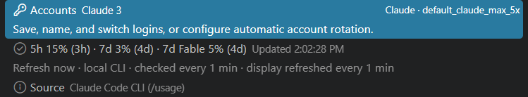
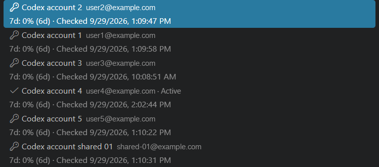

# Configuration reference

All options live under **AI Usage** in the Settings editor (`Ctrl+,` / `Cmd+,`, then search *AI Usage*) and start
with `aiUsage.` in `settings.json`. In a Remote-SSH, WSL or container window, **Preferences: Open Remote Settings**
lets you override options for that host. Machine-specific paths and connection settings appear only in the
Remote tab there; feature switches also appear in the User tab.

The Claude and Codex Accounts menus end with a **Claude settings…** / **Codex settings…** item that opens Settings
filtered to that service, including its config section:

## Sources

Each service has a `source` setting that selects where its usage is read from:

| Setting | Options | Default | Notes |
|---|---|---|---|
| `aiUsage.claude.source` | `both`, `cli`, `api`, `accountFile` | `both` | `cli` runs Claude Code's own `/usage` (set `aiUsage.claude.cliPath` if it is not on PATH): no model is called and nothing is billed, but Claude Code reaches the usage endpoint to answer it, so it is spaced like `api`. `accountFile` reads the usage Claude Code itself cached in `~/.claude.json` — no network call, so it can be polled every few seconds (`aiUsage.claude.accountFile.checkIntervalSeconds`), but it is only as fresh as Claude Code's own last request, and Claude Code drops that cache on an account switch until something asks it for usage again. |
| `aiUsage.codex.source` | `both`, `cli`, `api`, `sessionLog` | `both` | `cli` runs `codex app-server` (set `aiUsage.codex.cliPath` if it is not on PATH). `sessionLog` is offline but only as fresh as your last Codex turn. |
| `aiUsage.copilot.source` | `api` | `api` | The Copilot CLI has no headless usage command. |

`both` combines the two: the local file is re-read on every check and used while its reading is no older than that
service's `checkIntervalMinutes`; once it falls behind, because the CLI has been idle or has never written one, the
service endpoint fills the gap, called no more often than the `api` source would call it. Usage therefore follows an
active CLI session within seconds without spending more of the service's rate limit, and keeps updating when no
session is running.

## Copilot CLI sessions

The Copilot CLI bridge is experimental and still in development: it is not fully working yet, and its behaviour can
change between releases. Open **Settings → Extensions → AI Usage → Copilot CLI bridge (experimental)** for the CLI
bridge options, including separate **Codex** and **Claude** controls for persistent sessions, opening in the CLI,
and plugin links.
You can also search Settings for `@ext:p0l0us.ai-usage-vscode-plugin aiUsage.bridge`.

| Setting (`<provider>` is `codex` or `claude`) | Default | Purpose |
| --- | --- | --- |
| `aiUsage.bridge.<provider>.persistSessions` | `false` | Save new sessions in native CLI history so they can be reopened later. |
| `aiUsage.bridge.<provider>.openInCli` | `false` | Show an Open in CLI link and copyable resume command above the answer once the native session starts. |
| `aiUsage.bridge.<provider>.openInExtension` | `false` | Show an Open in Codex/Claude Code chat link above the answer, targeting that exact saved session. |
| `aiUsage.bridge.<provider>.sessionDirectory` | Empty | Workspace directory for saved sessions; empty uses the current single workspace folder, falling back to `~/.cli-byok-bridge/workspaces/<provider>`. |

Enable **Persist Sessions** before starting a new conversation. When using an **AI Usage CLI Bridge**
model in Copilot, the enabled controls appear above the answer as soon as the native session ID is
available, without HTML markers. The command includes the session's working directory and can be
copied into a terminal on the extension host. Links route back to this host, check the exact session,
and prefer the native sidebar; Claude uses its session-opening command rather than its editor-only URL.
Opening Claude also selects its sidebar preference. Claude requires the session workspace to be open
in VS Code. Open after the response completes and the native worker is released; an early click explains
that the session is still running. Tool continuations do not repeat the header. Existing replies are not
retroactively updated. **AI Usage: Inspect CLI Sessions** remains available for metadata and opening actions.
These options apply to the extension
host. The feature switches appear in **User** settings even in an SSH/WSL/container window, with
host-specific overrides available in **Remote** settings. Connection settings, CLI executable paths,
and session directories remain machine-specific: use the **Remote** tab for those in remote windows.
Bridge settings are excluded from Settings Sync by default. The existing
`aiUsage.bridge.*` setting keys remain unchanged. Model discovery, bridge startup, connection, and
CLI executable settings are in the same Copilot CLI bridge section. See the [bridge guide](../bridge/README.md)
for details.

## Intervals

- `aiUsage.<service>.checkIntervalMinutes` (Claude 10, Codex 5, Copilot 5): how often that service's source is
  called and the result stored in the shared on-disk cache. One call serves every open window. Claude's accepts
  fractional minutes down to 0.25 (15 seconds); its endpoint calls are still spaced by
  `aiUsage.claude.api.minIntervalSeconds` and by any limit the endpoint advertises.
- `aiUsage.updateIntervalMinutes` (1): how often every window re-reads the cache and redraws the status bar and
  chat chip details. Applies to all sources.

  The AI Usage menu shows both intervals under a service's usage row, and the source of its current reading beneath:

  

- Manual **AI Usage: Refresh**, and clicking a service's usage row in the details panel, bypass the check interval
  but still honour a shared backoff after a rate-limit or server error (`Retry-After` when sent, otherwise 1 to
  30 minutes doubling) and, for Claude, the call budget below.
- `aiUsage.claude.api.minIntervalSeconds` (30): the smallest gap between two calls to Anthropic's usage endpoint,
  counted across all open windows, every saved account and manual refreshes. Anthropic rate-limits this endpoint
  and does not document the limit, so the extension also adopts a stricter spacing when a response advertises one
  (`anthropic-ratelimit-requests-remaining`/`-reset`, or `Retry-After`): whatever quota a response reports is
  spread over the rest of its window. A refresh that arrives too early shows the cached reading and says when the
  next call is due. `0` leaves only the service's own limits.

## Other settings

- `aiUsage.statusBar.enabled` (default on): show the usage items in the status bar at all.
- `aiUsage.statusBar.labels`: what precedes the figures in a status bar item: `none` (figures only), `nameOnly`,
  `iconOnly` (default) or `iconAndName`.
- `aiUsage.statusBar.usage`: `rich` (default) shows every window, `17% (3h) 25% (3d)`; the value in parentheses
  is time until reset, reduced to one largest unit (`42m`, `3h`, or `4d`). `simple` shows only the most-used window.
- `aiUsage.claude.statusBar.accountNumber` / `aiUsage.codex.statusBar.accountNumber` (default `true`): put the
  active saved profile's position in the Accounts list between the icon and the figures, e.g. `#2 17% (3h)` after the Claude icon.
  Shown only when the service has at least two saved profiles and the active login is one of them.

  

- `aiUsage.chatChips.labels`: `name` (default) prefixes the first chip with the service name, `Claude 4%`;
  `none` shows figures only. Chips cannot carry the vendor icon: VS Code drops the text of a toolbar item that has
  an icon.
- `aiUsage.chatChips.usage`: `rich` (default) shows one percentage chip per window, `Claude 4%` `26%`; `simple`
  shows the most-used window only, `Claude 26%`. Click a chip to see window names and reset countdowns. Copilot has
  a single monthly window, so both modes look the same for it.
- `aiUsage.chatChips.workbench`: `whenNoStatusBar` (default) shows the chip in a regular VS Code window only when no status bar shows the same figures; `always` or `never` override that. The Agents window has no status bar, so the chip there follows `aiUsage.chatChips.agentsWindow`.
- `aiUsage.claude.enabled` / `aiUsage.codex.enabled` / `aiUsage.copilot.enabled`: toggle the live items (default on).
- `aiUsage.copilot.account`: GitHub login to use when several are signed in.
- `aiUsage.chatChips.enabled`: toggle the chips beneath the chat input (default on). Clicking a chip opens the
  details panel for that agent. Hovering a chip only repeats its text; VS Code offers extensions no richer tooltip
  on that toolbar.
- `aiUsage.chatTokens.enabled`: show the consumed-token chip for the newest local Claude or Codex session in the
  current workspace (default on). Its compact value is rounded; clicking it shows exact input, output and cached
  input counts. VS Code does not expose another extension's active chat id, so if several chats run concurrently,
  the most recently updated matching session is shown. Copilot's per-chat telemetry is not available to extensions.
- `aiUsage.chatChips.agentsWindow`: also show the chip in the Agents window (default on; see
  [Agents (sessions) window](AGENTS_WINDOW.md) for the required one-time setup). The extension there runs
  on your local computer and shows the logins found there, also for remote sessions; a chat whose agent is not signed in
  locally gets an `n/a` chip.
- `aiUsage.chatChips.debug` (default off): diagnostic. Adds a test chip and shows every service's chip regardless
  of the chat's agent (Copilot's in a Claude chat, for example). Not needed to enable the chip.
- `aiUsage.accounts`: optional manual figures; the `AI xx%` item appears only when set.

## Claude and Codex authentication profiles

Authentication profiles are commands, not settings, because credentials must never appear in `settings.json`.
Run **AI Usage: Manage Claude/Codex Authentication Profiles** to save the current native login, import a credential
JSON file, rename/delete profiles, or activate one of up to 20 profiles per service. The profiles, logins included,
are kept by the [account service](#account-service) in `~/.ai-usage/profiles.json` (mode 0600), or in a project's
profile file; the extension and the `ai-usage` command only ever go through the service.

### Private and project profiles

A profile is either **private** or a **project** profile. Private profiles are the ones described above, kept by the
account service in `~/.ai-usage/profiles.json`. Project profiles live in the workspace folder, in
`.ai-usage.profiles.json` by default (`aiUsage.projectProfiles.file` sets another path, relative to the folder),
name and login together (mode `0600` on Linux and macOS; the file has the format of a profile export), and are
listed whenever a connected window has that folder open, on any computer that opens it, or when `ai-usage` runs
with `--project[=<dir>]` or from a directory that holds such a file. Both kinds appear in the same Accounts menu
and in `ai-usage list`; a project profile shows `project <folder>` beside its email. Refreshed tokens, renames and
deletions are written back to the file, and a file edited by hand is read again when it changes.

**Save current login…** and **Import credential JSON…** ask which kind to create when both kinds are enabled and a
local folder is open; with only one kind possible, that kind is used without asking. `aiUsage.privateProfiles.enabled`
and `aiUsage.projectProfiles.enabled`, both on by default, are the switches; turning one off only stops new profiles
of that kind, and existing ones stay listed (project profiles are not loaded at all while their switch is off).
**Import saved profiles…** always adds private profiles; to make project profiles from an export, copy the export
file to the folder's `.ai-usage.profiles.json`. From a terminal, `ai-usage save <service> <name> --project` and
`ai-usage import … --project` keep the new profile in the current directory's file (`--project=<dir>` names
another folder). The three settings are mirrored to the service's `privateProfiles.enabled`,
`projectProfiles.enabled` and `projectProfiles.file`.

Known limitation: the account service is one per host, so the project profiles of every folder open in any
connected window (and any folder named to `ai-usage --project`) are merged into one list, and a project can be
used with another open project's profiles. Keeping them apart per folder may come later.

The file holds login tokens in plain text. When the folder is a Git repository, the first project profile saved
there adds the file's path to the folder's `.gitignore`, and a notification says so. Do not commit the file.

Each saved profile shows the login email beside its name, so the same account saved twice is easy to spot. Codex
emails come from the saved id token; Claude credentials carry no identity, so the email is read from the Claude
OAuth profile endpoint (or the local Claude Code account file when offline) when a login is saved, replaced or
refreshed, and once for older profiles when the menu opens. The email is stored with the profile name as non-secret
metadata.

The Accounts menu lists the saved profiles with their email, last valid usage reading and check time, marks the active
one, and follows with **Save current login…** and **Manage saved profiles…**:

**Manage saved profiles…** contains credential import and profile transfer even when no profiles are saved. With
saved profiles it also offers sign-in, rename, move and delete. Moving a profile changes the order used by the
Accounts menu and sequential rotation; a project profile moves within its own folder. The terminal equivalent is
`ai-usage move <service> <profile> up|down`.

The AI Usage menu of all services confirms which profile is active and shows its detected plan:

Switching updates the same provider-native credential file used by its CLI and VS Code extension. The write uses
an atomic replacement; its temporary and resulting file use mode `0600` on Linux/macOS and the containing
user-profile directory's ACL on Windows. For Claude only the `claudeAiOauth` object is replaced, so `mcpOAuth.*`
entries remain untouched. Codex `auth.json` is replaced as a unit. When the native active login can be matched
safely to its saved profile (Codex account id, Claude organization, or an identical refresh token), refreshed token data
is captured before switching away. If a saved profile stops working with "Login expired" or "Invalid token", use
**Sign in again…** in its Accounts menu, or choose the profile itself: an account marked **Login problem** is not
activated but opens a menu with **Renew the login…** (the same sign-in), **Try a keep-alive** (a keep-alive refreshes
an expired token, and when the login cannot be refreshed its failure notification offers **Sign in again**),
**Select anyway** (activates the login as it is) and **Back**. The sign-in runs the vendor CLI's login in a
terminal whose home is a folder inside the keep-alive
home, so the active login is not touched; the new login is stored in the profile, and written to the native file
only when that profile is the active one. While the sign-in is pending (from **Sign in again…** or `ai-usage
login`), that service's keep-alives and rotation wait for it, and a keep-alive or sweep started by hand says that
a sign-in is in progress; the wait ends with the sign-in, or after 20 minutes at most. A keep-alive or usage check
that finds a login revoked, or expired and not
refreshable, says so once in a notification with the same **Sign in again** action. Signing in natively and using
**Save current login** to replace the profile still works too.

**Save current login…** offers to create a new profile or to replace an existing one with the native login:

### Moving profiles to another computer

**Export or import saved profiles…** under **Manage saved profiles…** in either Accounts menu opens a picker with both actions; the
Command Palette has them as **AI Usage: Export Claude/Codex Authentication Profiles…** and **AI Usage: Import
Claude/Codex Authentication Profiles…**. **Export saved profiles…** lists every saved Claude and Codex profile,
preselected, and writes the chosen ones with their logins to a JSON file, which then opens in the editor; on Linux
and macOS the file gets mode `0600`. **Import saved profiles…** reads that file and shows what each entry would do before anything is written. A profile not saved here is added with its name (numbered when the name is taken), email and
account id. A profile that is saved here but has no login stored gets the login restored. One whose saved
login differs is left unselected and replaces the login only when chosen, and one already saved with the same login
is skipped. Nothing is activated, and the 20-profile limit per service applies. The export file holds the login
tokens in plain text: import it, then delete it.

The saved profiles belong to the [account service](#account-service) of the host the extension runs on: your
computer in an ordinary window, the remote host in a Remote-SSH, WSL or container window. Every window connected
to that host, and the `ai-usage` command there, see the same profiles, and activating one writes that host's
native credential file. Another computer starts with an empty profile list; export and import carry the profiles
across.

An exported login is a copy of the same session, not a new sign-in. Both vendors rotate the refresh token whenever
a login is refreshed, after which a copy that still holds the old refresh token fails its next refresh with
**Login expired** or **Invalid token**, and the login can get revoked. Do not let two computers refresh the same
profile: keep keep-alive and automatic rotation on for one of them only, or use **Sign in again…** on the second
computer to give each profile a session of its own there.

### What happens to running Codex sessions

A switch replaces `auth.json`, and every Codex process started afterwards, such as `codex` in a new terminal, uses
the new login. Processes that were already running do not: Codex keeps its login in memory, notices on its next turn
that the file changed underneath it and fails that turn with *"signed in to another account"* rather than adopting
the new credentials (verified against Codex 0.154.0). The Codex VS Code extension starts its `app-server` once and
never respawns it, VS Code cannot restart a single extension, and the extension's own recovery path is a full window
reload. AI Usage offers two ways out.

**Codex account proxy** (`aiUsage.codex.proxy.enabled`, experimental, off by default). AI Usage starts a small HTTP
server on `127.0.0.1:43117` (`aiUsage.codex.proxy.port`) and adds a `model_providers.ai-usage` entry to Codex's
`config.toml`, selected as `model_provider`. Codex re-reads that file whenever a chat starts, so from the next new
chat on, the Codex extension and the CLI send their model requests to the proxy without credentials; the proxy reads
`auth.json` *for every request*, attaches the active login and forwards the request unchanged: ChatGPT logins to
`chatgpt.com/backend-api/codex`, API keys to `api.openai.com`. A switch therefore reaches every chat on the proxy
on its next turn, and nothing is restarted. What changes for you: Codex's own account panel shows no login while the
provider is selected (the AI Usage status bar keeps showing the usage), Codex's `/status` reports
`Rate limit: Unavailable` until the chat's first turn — it reads limits from a login the app-server no longer knows,
and only learns them again from the rate-limit data the proxy passes back with each model response (verified with a
proxied turn on 0.155.0) — chats opened before the proxy was enabled keep their previous path until you start a new
chat, and failed Codex model requests are noted in the AI Usage log. One
AI Usage window serves the port and the others share it; when the serving window closes, the provider entry is
removed until another window takes the port over (within a minute), and turning the setting off restores
`config.toml` to what it was. Only the managed block between two marker comments and the `model_provider` line are
touched. AI Usage's own usage checks pin `model_provider = "openai"` and are unaffected. The proxy answers only
requests addressed to `127.0.0.1` that carry a token it writes into `config.toml`, so a web page on the same machine
cannot use the login through it; anything that can read `auth.json` could use the login anyway. When the ChatGPT
backend answers 401, the proxy asks Codex itself to refresh the tokens once (a fresh `codex app-server` on the
native home rewrites `auth.json`) and retries.

**Restart hint** (while the proxy is off). AI Usage always says so in the switch message. Set
`aiUsage.codex.switchRestartHint` to `true` and, in each window whose Codex process predates the switch, it also
shows one warning per switch with a **Restart extensions** action. That restarts only that window's extension host;
editors and terminals stay open and Codex chats reopen from their local session files. Nothing is killed and nothing
restarts by itself. The warning is off by default because it interrupts every window holding an older Codex
process.

Right after the write, AI Usage starts a fresh `codex app-server` on the native home and checks that the login it
reports (`getAuthStatus`, falling back to `account/read`) is the activated profile. A mismatch is shown as an error
instead of the success message; the previous `auth.json` remains recoverable from its saved profile because refreshed
tokens are captured before every switch.

**Never save one login twice.** Both vendors rotate the refresh token on every refresh. Two saved profiles of the same
account are refreshed independently by the keep-alive and by switching, so one of them eventually reuses a rotated
refresh token, and the provider then revokes the whole login (`token_revoked`); only a fresh `codex login` or
`claude` sign-in repairs that. AI Usage shows each profile's email, marks duplicates in the menu and warns before
saving a login whose email is already saved.

Claude profile activation also synchronizes `~/.claude.json` from the activated OAuth token so Claude's `/status`,
`/usage`, account UUID and cached usage do not stay attached to another member of the same Team. If Anthropic's
profile endpoint cannot be reached (it rate-limits per account), the switch still happens, the previous account's
identity is cleared rather than left on display, the notification says the login could not be confirmed, and AI Usage
keeps retrying in the background until `/status` agrees with the switch. Claude Code reads its credential file per
turn, so open Claude chats and CLI sessions follow a switch from their next turn; no restart or window reload is
needed. (Codex is different and does need one — see `aiUsage.codex.switchRestartHint` above.)

If you would rather keep two accounts side by side than switch one home, start a VS Code window with
`CODEX_HOME=~/.codex-<account>`: the Codex extension resolves its home from that variable and AI Usage follows it
for reading usage and for its profile commands, so the two windows stay independent.

The extension is workspace-first. In Remote-SSH, WSL, and dev-container windows it runs remotely and manages that
host's native credential files; in an ordinary Windows/macOS/Linux window it runs locally. The saved profiles and
their logins are kept by the account service of that same host, in `~/.ai-usage/profiles.json` (mode 0600 inside
a mode 0700 directory), and a profile list only moves to another computer through **Export saved profiles…** and
**Import saved profiles…** (see [Moving profiles to another computer](#moving-profiles-to-another-computer)).

The active native credential is necessarily still plaintext and readable by processes running as your OS user.
The saved copies are in the same class: a mode-0600 file of the same user, like the vendors' own credential files.
Earlier versions kept them in VS Code's SecretStorage, which protected them from project files and ordinary
extension storage but not from processes running as you; the service's file does not
change the security model of the vendor CLI. Credential files selected with **Import** are not deleted by the
extension.

### High-usage highlighting

Status-bar items turn yellow when any displayed window reaches 80% usage and red at 95%. In this example Claude's
92% window resets in 3 hours, so Claude is highlighted while Codex remains neutral at 77%:

## Claude Code config

The **Claude Code config** settings section sets how many agents Claude Code runs at once, through environment
variables in the `env` object of Claude Code's user settings (`settings.json` in `$CLAUDE_CONFIG_DIR`, default
`~/.claude`):

| Setting | `settings.json` entry | Claude Code default |
|---|---|---|
| `aiUsage.claudeConfig.env.maxConcurrentSubagents` | `env.CLAUDE_CODE_MAX_CONCURRENT_SUBAGENTS` (Claude Code 2.1.217+) | 20 |
| `aiUsage.claudeConfig.env.workflowMaxConcurrentAgents` | `env.CLAUDE_CODE_WORKFLOW_MAX_CONCURRENT_AGENTS` (Claude Code 2.1.269+, at most 256) | 16, fewer on machines with few CPUs |

Every setting defaults to empty (`null`), which leaves the file alone. A set value is written as a string when
AI Usage starts and whenever the setting changes. Claude Code reads it when a session starts, so running sessions
keep the old value until they are restarted. Other keys and `env` entries are kept, and the file is written with
its own indentation. A file that is not valid JSON is not touched, and the problem is noted in the AI Usage log.
Clearing a setting later does not remove the value from the file. The project `.claude/settings.json` is never
changed. A higher cap does not raise the account's usage limit, so more parallel agents reach it sooner.

## Codex config

The **Codex config** settings section sets a few keys of Codex's own `config.toml` in the Codex home
(`$CODEX_HOME`, default `~/.codex`), so they can be changed from VS Code settings (and synced with them) instead of
by editing the file:

| Setting | `config.toml` key |
|---|---|
| `aiUsage.codexConfig.agents.maxConcurrentThreadsPerSession` | `[agents] max_concurrent_threads_per_session` |
| `aiUsage.codexConfig.agents.maxDepth` | `[agents] max_depth` |
| `aiUsage.codexConfig.agents.jobMaxRuntimeSeconds` | `[agents] job_max_runtime_seconds` |

Every setting defaults to empty (`null`), which leaves the file alone. A set value is written when AI Usage starts
and whenever the setting changes; Codex reads `config.toml` when a chat starts, so chats started afterwards use it.
Only that one `key = value` line changes (a trailing comment on it is kept, the rest of the file is untouched); a
missing `[agents]` table is added, and a root-level `agents.<key> = …` line is updated in place. Clearing a setting
later does not remove the value from the file, and a manual edit of the key is overwritten the next time AI Usage
starts while the setting is set. Invalid values and an `agents = { … }` inline table are skipped and noted in the
AI Usage log.

## Account service

Saved profiles, keep-alives and automatic rotation run in the account service, one per host, which the
`ai-usage` command controls as well. It runs either in the background, whether VS Code is open or not, or inside
VS Code while a window is open.

**Where the profiles are.** With the background service, its private profiles are in `~/.ai-usage/profiles.json`
(mode 0600), usable without VS Code. Without it, the private profiles are the ones saved in VS Code (global state
and SecretStorage), exactly as before the service existed. Project profiles (`.ai-usage.profiles.json` in an open
folder) are listed in both cases. Nothing moves between the two on its own: **AI Usage: Account Service…** →
**Transfer profiles from VS Code to the account service…** or **…from the account service to VS Code…** copies or
moves the chosen profiles, logins included. Moving removes each profile from the source once the target holds it,
so a login is refreshed in one place only; copying keeps both, and a login refreshed in one place can then stop
working in the other. When the store in use has no profiles and the other one has some, AI Usage offers to move or
copy them once per session, for example right after installing the background service.

**Inside VS Code.** Until the background service is installed, or with `aiUsage.accountService.background` off,
the extension runs the same service inside a VS Code window: the first window that finds no service answering
hosts it on the service socket, the other windows (and the `ai-usage` command, when installed) use it, and when
that window closes another one takes over within a few seconds. Nothing is installed or registered and nothing
keeps running once VS Code is closed; accounts, keep-alives and rotation work as long as a window is open.
**AI Usage: Account Service…** shows "Running inside this VS Code window". A background service that is already
running, for example one started from a terminal, is used instead.

**Installation.** On activation, with no service installed, the extension asks once per session: **Install**,
**Not now** (the service runs inside VS Code for this session) or **Don't ask again** (which turns
`aiUsage.accountService.background` off, so it keeps running inside VS Code; turn the setting on again to be asked
again, or run **AI Usage: Install Account Service**). The extension copies the service package it carries to
`~/.ai-usage/service/<version>`, writes the `ai-usage` launcher to `~/.ai-usage/bin`, registers the service to
start at sign-in and starts it. It looks for Node.js 20 or newer on the PATH and in the usual install locations
(`nvm`, `volta`, `/usr/local/bin`, …), and falls back to VS Code's own runtime (`ELECTRON_RUN_AS_NODE`) or, in a
remote window, the VS Code server's. `AI_USAGE_NODE` names one explicitly. When the extension is updated and
carries a newer service, the installed one is replaced and restarted without asking. Profiles saved in VS Code
stay there until you transfer them (see above).

**Autostart.** Linux: a systemd user unit `ai-usage.service` in `~/.config/systemd/user`, enabled, with
`loginctl enable-linger` attempted so the service also runs while you are logged out (when that needs a password,
the log says so and the service runs while you are logged in). macOS: a launchd agent
`~/Library/LaunchAgents/com.p0l0us.ai-usage.plist`, restarted after a crash but not after a deliberate stop.
Windows: a value under `HKCU\Software\Microsoft\Windows\CurrentVersion\Run` that starts the service hidden.
Without a systemd user manager (some containers) nothing is registered; the extension and the `ai-usage` command
start the service when they need it.

**The `ai-usage` command.** `ai-usage --help` lists everything. `ai-usage` alone in a terminal opens the live
view; `status` and `list` print the same information, `use <service> <profile>` switches (by name, number or
id), `save`, `import`, `rename`, `delete`, `login`, `keepalive`, `rotate`, `export` and `import-profiles`
do what the Accounts menus do, `config` shows or changes the settings, `service status|install|uninstall|start|
stop|restart|run` manages the service, `log` shows its log and `mcp` serves the
[MCP tools for AI agents](#mcp-server-for-ai-agents-experimental). `--project[=<dir>]` lists a project folder's
profiles and, with `save` and `import`, keeps the new profile there. VS Code terminals see the command through
the extension's terminal environment; elsewhere add `~/.ai-usage/bin` to your PATH.

**Settings.** The service keeps its settings in `~/.ai-usage/config.json`; `ai-usage config` reads and writes
them and the extension keeps them equal to `aiUsage.claude.*`, `aiUsage.codex.*`, the profile scope settings and
`aiUsage.mcp.*`: the first connection seeds the service from the user settings, after that a change in Settings
is pushed to the service and a change made with `ai-usage config` is written to the user settings. The usage
sources of the status bar (`aiUsage.<service>.source`) stay with the extension.

**What is where.** Everything is under `~/.ai-usage` (`AI_USAGE_HOME` moves it): `profiles.json` (the private
profiles with their logins, mode 0600), `config.json`, `state/` (per-account readings, sweep records, lock files
and the Claude endpoint call ledger, shared with the extension's status bar reads), `service.log`, `service.sock`
(a named pipe on Windows) and `service.token`, which clients present first. **AI Usage: Account Service…** shows
the status, opens the log and starts, stops, restarts, reinstalls or uninstalls the service; uninstalling keeps the
data files.

| Setting | Default | Purpose |
| --- | --- | --- |
| `aiUsage.accountService.enabled` | `true` | Use the account service. Off: no Accounts menus, keep-alives or rotation in this window. |
| `aiUsage.accountService.background` | `true` | Offer to install the service as a background process. Off, or until it is installed: it runs inside VS Code while a window is open. Turning it off does not uninstall an installed service. |

**Without VS Code.** The service is also the npm package `ai-usage-service` (Node.js 20 or newer, no
dependencies): `npm install -g ai-usage-service`, then `ai-usage service install` sets it up exactly as the
extension does, or `ai-usage service run` keeps it in the foreground. The extension uses a service installed this
way as its own.

## MCP server for AI agents (experimental)

The account service can serve its profiles to AI agents over the Model Context Protocol: `ai-usage mcp` is a stdio
MCP server whose tools list every saved profile with its usage windows (`list_accounts`), read a fresh reading for
one profile (`refresh_usage`) and, when allowed, switch the active account (`switch_account`) or run a rotation
sweep (`rotate_account`). While it is on, the extension also offers the server to the agents of the VS Code window
as **AI Usage accounts**, so Copilot agent mode and other consumers of the editor's MCP servers see it without any
configuration. **Set up MCP server…** in the top-level AI Usage menu installs and enables it, then registers it with
the Claude or Codex CLI. Their Accounts menus offer the same registration while MCP is on. Registration runs the
CLI's own `mcp add` for `~/.ai-usage/bin/ai-usage mcp`, and other command-line agents register that command
themselves. The feature is experimental, off by default, and described in [MCP server for AI agents](MCP.md): the tools, their answers, how to register the
server with Claude Code and Codex, and what a switch by an agent means.

| Setting | Default | Purpose |
| --- | --- | --- |
| `aiUsage.mcp.enabled` | `false` | Serve the MCP tools and offer the server to the agents of this window. Mirrored to the service's `mcp.enabled`; checked on every tool call. |
| `aiUsage.mcp.switching` | `true` | Offer `switch_account` and `rotate_account`; off leaves agents the usage tools only. Mirrored to `mcp.switching`. |

## Account automation

Save or import each subscription login in **AI Usage: Manage Claude/Codex Authentication Profiles**. Under each
provider's **Accounts** menu you can switch accounts manually and send a keep-alive on demand; both features are
turned on in Settings, per provider, and default to off. The menu shows their current state and links to Settings.

Account checks of one service run one at a time in the account service. A keep-alive sent by hand that finds a
sweep running waits for it, up to 3 minutes, and says so in its progress notification, which can be cancelled;
**All accounts** (and `ai-usage keepalive --all`) runs as one sweep in the service, so a periodic check cannot cut
in between two accounts. Once the wait runs out, the notification says that the accounts were not sent.

| Setting suffix (`aiUsage.claude.` / `aiUsage.codex.`) | Claude default | Codex default | Purpose |
| --- | --- | --- | --- |
| `keepAlive.enabled` | `false` | `false` | Periodically check every saved account, including inactive ones. |
| `autoRotate.enabled` | `false` | `false` | Switch accounts automatically once the active one reaches a threshold. |
| `keepAlive.periodHours` | `2` | `6` | Per-account keep-alive period, minimum 0.25 hours. |
| `autoRotate.fiveHourThresholdPercent` | `95` | `100` | Threshold for the 5h window; Codex's default rotates only on a used-up window. |
| `autoRotate.weeklyThresholdPercent` | `99.5` | `99` | Threshold for the weekly windows (`7d`, and `7d Fable` when it counts). |
| `autoRotate.modelLimits` | `auto` | — | Whether `7d Fable` counts: `auto` (when Claude Code's `model` is Fable or unset), `always`, `never`. |
| `autoRotate.strategy` | `soonestReset` | — | How the next account is chosen: `soonestReset`, `evenPace`, `leastWaste` or `sequential`. |
| `autoRotate.trigger` | `limit` | — | `limit` switches only at a threshold; `proactive` also switches to a clearly better account. |
| `autoRotate.minStayMinutes` | `30` | — | With `proactive`, how long a newly active account is kept before another proactive switch. |
| `keepAlive.home` | `~/.claude-tmp` | `~/.codex-tmp` | Dedicated CLI home; must be separate from the native home. |
| `keepAlive.model` | `haiku` | `gpt-5.6-luna` | Select a subscription model for the small request. |
| `cliPath` | `claude` | `codex` | CLI command or executable path. |

Codex defaults to Luna for small background calls, following [OpenAI Docs model usage guidance](https://learn.chatgpt.com/docs/pricing).
Use a model available to your subscription; an empty Codex model setting selects the CLI default.

Every keep-alive asks exactly `what is date today`. Requests use a separate working directory and CLI home,
with inherited authentication and provider routing overrides removed. Claude tools and custom hooks are disabled;
Codex runs noninteractively with a read-only sandbox. A keep-alive has a 90-second timeout. The extension attempts
to collect usage even if the small model call fails. Claude uses the OAuth usage endpoint, and Codex uses
`account/rateLimits/read` through its app-server with the same staged login. Codex API-key-only profiles do not
expose subscription quota windows and cannot qualify as automatic rotation targets.

The configurable home is dedicated to this feature. Relative paths resolve from the OS user home, and `~/` is
expanded. Credentials are staged using an atomic write with mode 0600 on POSIX and removed after the check.
The CLI may retain its own diagnostic/configuration files there. Refreshed credentials are saved back only if the
saved profile has not changed in the meantime; an unchanged active native login receives refreshed tokens too.

Per-account readings and attempt timestamps persist in the service's `state` directory without credentials.
The service's one-minute scheduler checks due accounts whether VS Code is open or not; after the service was
stopped, each overdue account is checked once, without replaying missed intervals. Each provider checks its
accounts sequentially. Failed keep-alive attempts wait the configured interval; transient usage errors honor the
provider check interval and any longer `Retry-After`.

### Rotation strategies and thresholds

Full description with worked examples: **[Account rotation: strategies and thresholds](ROTATION.md)**.

- **When.** The active account rotates as soon as any counted window reaches its threshold (`usage ≥ threshold`):
  Claude 95% in `5h` or 99.5% weekly, Codex 99% weekly or a used-up `5h`. See [Thresholds](ROTATION.md#thresholds).
- **Where.** Only to an account below its threshold in **every** counted window, read again and sent a keep-alive
  just before the switch. This holds for every strategy and trigger. When no account qualifies, the active one is
  kept and a notification says so.
- **Which first** (`aiUsage.claude.autoRotate.strategy`; Codex is always `sequential`):
  - [`soonestReset`](ROTATION.md#soonestreset-default) (default): the weekly window that resets soonest, so expiring
    allowance is spent first.
  - [`evenPace`](ROTATION.md#evenpace): the account furthest behind an even spend from 0% to 100% over its week.
  - [`leastWaste`](ROTATION.md#leastwaste): the most weekly allowance left per hour until reset.
  - [`sequential`](ROTATION.md#sequential): the next saved profile in list order.
- **Proactive.** `aiUsage.claude.autoRotate.trigger: proactive` also leaves a working account for a clearly better
  one, after `autoRotate.minStayMinutes`. Thresholds still apply. See
  [Proactive switching](ROTATION.md#proactive-switching) and [Which setup to choose](ROTATION.md#which-setup-to-choose).

CLI behavior references: [OpenAI Docs: noninteractive Codex](https://learn.chatgpt.com/docs/non-interactive-mode)
and [Claude CLI reference](https://code.claude.com/docs/en/cli-reference).

## Usage history

On by default (`aiUsage.history.enabled`), the account service appends what it learns about the saved Claude and
Codex accounts to one JSON Lines file per month, `history-YYYY-MM.jsonl`, in `usage-history` under its home
(`~/.ai-usage` on the computer the service runs on, the remote host in a remote session; **AI Usage: Show Usage
History…** and `ai-usage history path` show the path), or in `aiUsage.history.directory` (`~` and paths relative to
your home work). A file is deleted once its whole month is older than `aiUsage.history.retentionDays` (365). No login
material is written: an account appears as its profile id, name and email. An `index.json` beside the files keeps the
last recorded reading per account and the last switch per service, so an unchanged reading is written once an hour at
most. The three settings are mirrored to the service's `history.enabled`, `history.retentionDays` and
`history.directory`, which `ai-usage config` sets too.

Each line is one event with `t` (when it was written, ISO 8601), `provider` and `type`:

| `type` | When | What it holds |
| --- | --- | --- |
| `reading` | A saved account was read by the status bar (`source: status`), a keep-alive (`keepAlive`), a rotation sweep (`rotation`) or another check (`check`), and its figures changed, or an hour passed since the last recorded reading of that account | `account`, `active` (whether it was the active login), `usage` with the vendor's `at`, `plan` and `windows` (`label`, `usedPercent`, `resetsAt`) |
| `switch` | The active account changed | `from`, `to`, `reason` (`limit`, `proactive`, `manual`, or `external` for a switch made with the vendor CLI or by hand outside the service), `automatic`, `stayedMs` (how long `from` had been active), `fromUsage`, `toUsage`; for rotation also `settings` (strategy, trigger, thresholds, minimum stay), `calls` (endpoint calls the sweep spent) and `candidates`: every other account in the order the strategy preferred them, with its stored `score`, whether it looked `usable`, its fresh `usage` and `freshScore` when it was read, and its `outcome`: `chosen`, `problem` (its last check failed), `limited` (still at a threshold with the reset ahead), `notBetter` (not clearly better for a proactive switch), `ineligible` (at a threshold on the fresh reading, or a window missing), `keepAliveFailed`, `notReached` |
| `sweep` | A rotation sweep spent endpoint calls and switched nothing | `outcome` (`activeRecovered`: the stored reading was out of date; `noBetterCandidate`; `noCandidate`), `usage`, `candidates`, `calls`, `settings` |
| `exhausted` | The active account reached a threshold and no saved account could take over; once per such stretch | `active`, `usage`, `reached` (the windows at their threshold), `candidates`, `nextCandidateAt` (the earliest reset among the candidates still at their limit) |
| `recovered` | That stretch ended | `by` (`reset`: the active account read below its thresholds again; `switch`), `afterMs` |
| `check` | An account check started failing, failed differently, or works again | `account`, `ok`, `keepAlive`, `error`, `problem` (the error in a few words) |

**AI Usage: Show Usage History…** (also **Usage history** in the details panel) and `ai-usage history` (the last 30
days by default, `--days <n>` or `--all`) summarize a period as a Markdown document: per account the time as the
active login (measured between switches), the weekly cycles seen (one per reset; a cycle is complete once its reset
has passed) with their mean peak and how many reached the limit, 5-hour cycles at the limit, readings and failed
checks; per service the switches by reason with the median stay, the time with every account at its limit at once,
the sweeps that switched nothing and the endpoint calls rotation spent; and an estimate of how many accounts the
observed weekly use needs: the accounts' mean weekly peaks add up to the weekly demand in account-weeks, an account
counts as full at 85%, and one more account than saved is needed whenever every account was at its limit at once.
The estimate uses weekly windows only; 5-hour bursts can still force switches, and a proactive strategy spreads use
over accounts, so each account's peak understates what a single account would have used. The menu and `ai-usage
history export readings|events|jsonl [file]` also export the readings (one row per account, reading and window) or
the other events as CSV, and everything as JSON Lines; the menu opens the newest file.

| Setting | Default | Purpose |
| --- | --- | --- |
| `aiUsage.history.enabled` | `true` | Record readings, switches, sweeps, exhausted stretches and check changes. |
| `aiUsage.history.retentionDays` | `365` | Delete a month's file once the whole month is older than this. |
| `aiUsage.history.directory` | *(empty)* | Where the files go; empty is `usage-history` under the service home. A changed directory is used from the next event on; existing files are not moved. |

Copilot CLI bridge also exposes per-backend `subagentsEnabled` (default true in VS Code), `requestTimeoutMinutes`, and `toolTimeoutMinutes` (both default 60, range 1–1440). Native children delegate through Copilot’s tool relay. The `list_cli_subagents` tool shows native children and saved branches; `fork_cli_session` runs an analysis branch from a completed saved session.

The **Agent map** link in the first CLI session message opens `@aiusage /agents` in Copilot.
Each native subagent is linked once when it starts; select it for status, native ID, and its
reported result (up to 4,000 characters). The map is a snapshot; select its link again to
refresh. Parent and saved branch links navigate the task tree. Inspecting a map does not
leave the `@aiusage` participant selected for subsequent coding requests.

Released saved Codex children can open their exact native thread in Codex or the CLI,
subject to the existing opening switches. Claude children resume through their parent:
return to the original Copilot conversation and ask to resume the displayed agent ID.
Claude's native chat link opens the parent, not an independent child session.
Bounded child result summaries are retained alongside saved session metadata in the private
bridge records file. This does not add native IDE features that the bridge protocol does not expose.
