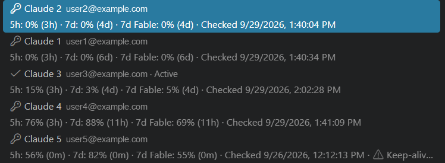

# Account rotation: strategies and thresholds

Automatic rotation switches the active Claude or Codex login to another saved profile. Two separate questions decide
what happens:

- **When** to switch, set by the thresholds and `autoRotate.trigger`.
- **Where** to switch to, set by `autoRotate.strategy`.
- **Whether a Codex switch should wait for a nearby quota reset**, set by `autoRotate.resetAware` (on by default).
- **Whether to redeem an earned Codex rate-limit reset**, set by `autoReset.enabled` (on by default), and by the
  provider-reported credit count and expiry.

The settings themselves are listed in [Account automation](CONFIGURATION.md#account-automation). All examples below
use the Claude thresholds (5-hour **95**, weekly **99.5**) unless they say otherwise. Codex thresholds default
to **100** and **99**. Both providers default to `leastWaste`, `proactive` and a **15-minute** minimum stay.
Strategy examples name the strategy they illustrate. A week is 168 hours.

The **Keep-alive and rotation settings…** item of each Accounts menu shows what is in effect. Here Claude has
keep-alives on and rotation on with `leastWaste`, `proactive` and custom thresholds, and Codex has keep-alives off
and rotation at the 99% weekly threshold:

- [Thresholds](#thresholds)
- [What starts a rotation](#what-starts-a-rotation)
- [Choosing the next account](#choosing-the-next-account)
  - [`sequential`](#sequential)
  - [`soonestReset`](#soonestreset)
  - [`evenPace`](#evenpace)
  - [`leastWaste`](#leastwaste)
  - [The four strategies side by side](#the-four-strategies-side-by-side)
  - [Details shared by the ranking strategies](#details-shared-by-the-ranking-strategies)
- [Proactive switching](#proactive-switching)
- [Which setup to choose](#which-setup-to-choose)
- [Safety](#safety)
- [Codex](#codex)
- [Codex reset-aware timing](#codex-reset-aware-timing)

## Thresholds

Every usage window of an account has a threshold, set by the kind of window:

| Window | Claude | Codex |
| --- | --- | --- |
| 5-hour (`5h`) | `autoRotate.fiveHourThresholdPercent`, default **95** | `autoRotate.fiveHourThresholdPercent`, default **100** (only a used-up window) |
| Weekly, all models (`7d`) | `autoRotate.weeklyThresholdPercent`, default **99.5** | `autoRotate.weeklyThresholdPercent`, default **99** |
| Weekly, one model (`7d Fable`) | the weekly threshold, when `autoRotate.modelLimits` counts the window | — |

The thresholds are used in two ways:

- **When to rotate.** The active account is *at its limit* as soon as any counted window's usage is **at or above**
  its threshold (`usage ≥ threshold`).
- **Where to rotate to.** General `5h` and all-models `7d` windows must remain **below** their thresholds.
  Claude first considers accounts below every counted window, including model-scoped windows such as `7d Fable`.
  If none qualifies, it can select an account with general quota remaining even when Fable is exhausted.
  This applies to every strategy. If the active account already has general quota remaining, it stays selected
  until a model-capable alternative appears, avoiding switches between equally model-limited accounts.

Model fallback does not change the selected model or restore its quota: `7d Fable: 100%` remains visible, and
manual selection remains available for that dimmed account. General exhaustion still blocks selection in the
Accounts menu. `autoRotate.modelLimits` continues to decide which model windows trigger rotation and receive
preference; `never`, or `auto` with a different configured model, keeps ignoring those windows.

**Example: when and where.**

| Account | `5h` | `7d` | At its limit? | Can be switched to? |
| --- | --- | --- | --- | --- |
| A (active) | 95% | 40% | yes, 5h ≥ 95 | — |
| B | 94% | 99% | no | yes, both below their thresholds |
| C | 20% | 99.5% | yes, 7d ≥ 99.5 | no |
| D | 96% | 10% | yes, 5h ≥ 95 | no |

A rotates, and B is the only possible target, whatever the strategy. B has little room left, so it will soon rotate
again; when no account qualifies, the active one is kept (see below).

**Example: a lower threshold also limits the other accounts.** With `weeklyThresholdPercent` set to 90, an account
at 92% weekly is neither kept as the active account nor switched to. The remaining 8% of its week stays unused.

**Example: no account qualifies.** A (active) reaches 5h 95%, B has 7d at 99.7% and C has 5h at 98%. The active login
is kept, the AI Usage log names the window that reached its threshold (`5h 95% ≥ 95%`), and a notification says once
that no account is available. It is shown again only after a switch, or after the active account has been below its
thresholds again. Another sweep runs after `aiUsage.<provider>.checkIntervalMinutes`, so C qualifies again once its
5-hour window resets.

**Model-scoped windows.** `autoRotate.modelLimits` (Claude) decides whether `7d Fable` counts at all:

- `auto` counts it when Claude Code's `model` setting is Fable or unset.
- `always` counts it.
- `never` ignores it.

A window that does not count neither starts a rotation nor blocks a candidate. With `modelLimits: auto` and Claude
Code set to Sonnet, an account at `7d Fable` 100% and `7d` 30% is a normal candidate.

## What starts a rotation

- A reading of the active account that reaches a threshold starts a sweep at once, without waiting for the
  one-minute scheduler. A reading at most 2 minutes old counts as the active account's current reading, so the
  rate-limited usage endpoint is not asked again.
- The service's Codex live collector can read session logs, which do not name an account, so their figures are never stored
  as a profile's reading. When they show a threshold reached, the next sweep reads the active account itself instead
  of trusting its stored reading, which may be hours old.
- The service refreshes the active login according to its source interval, even without VS Code. The one-minute
  automation scheduler also considers stored account readings; enabled keep-alives update other saved accounts.
- When the active account cannot be read (its checks are paused after a provider error), the sweep is retried as
  soon as that pause ends, not a full check interval later.

Every sweep first needs a successful current reading of the active account. If that reading turns out to be below
every threshold, nothing is switched (with the `proactive` trigger, the sweep goes on to look for a
[clearly better account](#proactive-switching)). Sweeps are spaced by the provider's check interval.

## Choosing the next account

Candidates are visited in the order the strategy ranks them, and the first one that passes is switched to. At most
one switch is made per sweep. Before switching, each candidate in turn is read again (it must still be below every
applicable candidate threshold and report the required windows of the active account; a Claude model fallback
uses the general windows) and is sent a keep-alive, because a usage
reading alone does not prove that the login works. A candidate that fails either check is skipped, and a broken
login is reported.

The strategy decides the **order**. With the `limit` trigger, every strategy attempts a switch when the
active account reaches a threshold; only [proactive switching](#proactive-switching) makes the strategy start
switches of its own. Codex's [reset-aware timing](#codex-reset-aware-timing) can defer an attempt briefly.

The readings the ranking works from are the ones the Accounts menu shows under each profile, with the time until
each window resets and when the account was last checked:

### `sequential`

The saved profiles after the active one, in list order, wrapping once. No score is computed.

**Example.** Profiles are saved as A, B, C, D, and B is active and at its limit. Rotation tries C, then D, then A. If
C's 5-hour window is at 97%, C fails the fresh check and D is chosen. The next time D reaches its limit, rotation
tries A, B and C in that order.

Choose `sequential` when you want predictable order, for example a main account followed by backups.

### `soonestReset`

**Score: hours until the weekly window resets. Lowest first.** Allowance that is about to expire is spent before it
is lost.

**Penalty:** an account more than **10 points ahead** of an even spend, with **more than half** of its week left,
goes to the back of the queue. This stops a fresh week from being used up in its first days just because its reset
happens to be the nearest one.

**Example: plain ranking.**

| Account | `7d` used | Resets in | Score |
| --- | --- | --- | --- |
| A | 70% | 20 h | **20** ← chosen |
| B | 10% | 60 h | 60 |
| C | 0% | 150 h | 150 |

A has the least left, but that 29.5% is gone in 20 hours anyway, while B and C keep their allowance for longer.

**Example: the penalty.**

| Account | `7d` used | Resets in | Elapsed share of week | Even spend | Ahead by | Score |
| --- | --- | --- | --- | --- | --- | --- |
| E | 60% | 96 h (4 days) | 43% | 43% | **+17** | 96 + penalty |
| F | 10% | 144 h (6 days) | 14% | 14% | −4 | **144** ← chosen |

E resets sooner, but it is 17 points ahead of an even spend with more than half its week left, so it goes last.

### `evenPace`

**Score: used % minus the share of the week already elapsed. Lowest first.** Picture a straight line from 0% at the
start of each account's week to 100% at its reset; the account furthest **below** its line is chosen. No account
runs out early, and all accounts use up their week at about the same time.

`elapsed share = 1 − hours until reset ÷ 168`

**Example.**

| Account | `7d` used | Resets in | Elapsed share | Score (used − elapsed) |
| --- | --- | --- | --- | --- |
| A | 88% | 12 h | 92.9% | −4.9 |
| B | 30% | 96 h | 42.9% | −12.9 |
| C | 0% | 120 h | 28.6% | **−28.6** ← chosen |

C is furthest behind its line, so it is used first, even though A's remaining 11.5% expires in 12 hours.

`evenPace` pays off most with the [proactive trigger](#proactive-switching), which keeps every account close to its
line while you work. With the `limit` trigger it only decides where to land when the active account is exhausted.

### `leastWaste`

**Score: weekly allowance left per hour until reset. Highest first.** Allowance left is the weekly threshold minus the
usage, so 99.5 − used with the Claude default threshold. This spends accounts in proportion to how quickly their allowance would
otherwise go to waste.

**5-hour bonus:** when an account's 5-hour window still has room and resets **within the hour**, its rate is raised
by 10%, because that unused 5-hour allowance is lost too.
For Codex with reset-aware timing on, the final five minutes of that hour are guarded, so the bonus never causes a
one-minute switch.

**Example: plain ranking.**

| Account | `7d` used | Resets in | Allowance left | Per hour |
| --- | --- | --- | --- | --- |
| A | 88% | 12 h | 11.5 | **0.96** ← chosen |
| B | 30% | 96 h | 69.5 | 0.72 |
| C | 0% | 120 h | 99.5 | 0.83 |

**Example: the bonus decides.**

| Account | `7d` used | Resets in | Per hour | `5h` | Final |
| --- | --- | --- | --- | --- | --- |
| G | 50% | 72 h | 49.5 / 72 = 0.69 | 60%, resets in 40 min | 0.69 × 1.1 = **0.76** ← chosen |
| H | 40% | 80 h | 59.5 / 80 = 0.74 | 10%, resets in 3 h | 0.74 |

Without the bonus H would win. G's remaining 5-hour allowance would be lost in 40 minutes, so G goes first.

### The four strategies side by side

The same three candidates as above, each picked by a different rule:

| Account | `7d` used | Resets in | `sequential` | `soonestReset` | `evenPace` | `leastWaste` |
| --- | --- | --- | --- | --- | --- | --- |
| A | 88% | 12 h | next in list | **12 h** ✅ | −4.9 | **0.96 %/h** ✅ |
| B | 30% | 96 h | next in list | 96 h | −12.9 | 0.72 %/h |
| C | 0% | 120 h | next in list | 120 h | **−28.6** ✅ | 0.83 %/h |

- `soonestReset` picks A because it resets first.
- `leastWaste` also picks A, but because it would waste the most per hour. If A reset in 40 hours instead
  (11.5 / 40 = 0.29 %/h), `leastWaste` would pick C while `soonestReset` would still pick A.
- `evenPace` picks C because it is furthest behind its line.
- `sequential` picks whichever comes next in the saved list.

### Details shared by the ranking strategies

These apply to `soonestReset`, `evenPace` and `leastWaste`:

- **Ranking uses stored readings.** Candidates are ranked from the readings already collected for each account (by
  keep-alives, the status bar and earlier sweeps), so ranking costs no endpoint calls. Only the candidates actually
  tried are read again.
- **Order of groups.** Accounts whose stored reading looks usable come first, best score first. Then usable accounts
  that report no weekly window, then those that look exhausted, then accounts never read. Ties keep saved-profile
  order.
- **An exhausted reading with its reset ahead is not read again.** Usage in a window only rises until its reset,
  so an account whose stored reading is still at a threshold, with that window's reset time still ahead, cannot
  have recovered: the sweep leaves it out without a call until the reset has passed, then reads it again. An
  exhausted reading without a known reset time is still tried, since only a fresh reading can tell.
- **A reset since the reading counts as fresh.** A stored reading of `7d` 97% with a reset time that has since passed
  is ranked as 0% used, with its next reset one week later. The account is still read again before any switch.
- **Headroom is measured up to the thresholds.** "Allowance left" is the threshold minus the usage, not 100 minus the
  usage.
- **The 5-hour window only blocks.** It does not change the ranking, except for `leastWaste`'s bonus. It acts through
  its threshold: an account at 5h 96% is never switched to, however good its weekly score.
- **A failed last check disqualifies.** An account whose last keep-alive failed, whatever the reason, or whose last
  usage check found a login problem, is not switched to and costs the sweep nothing, until a later check of it
  succeeds: the next periodic keep-alive, or **Send keep-alive now…**. The notification that no candidate remains
  names the accounts left out for that reason, and the accounts still at their limit by their last reading, with
  the time until their reset.
- **Several weekly windows: the tightest one decides.** When both `7d` and `7d Fable` count, `soonestReset` uses the
  window with the least allowance left, `evenPace` the one furthest ahead of its line, and `leastWaste` the lowest
  rate.

**Example: several weekly windows.** Account J has `7d` at 40% resetting in 24 h and `7d Fable` at 90% resetting in
100 h.

| | Only `7d` counts (`modelLimits: never`) | `7d Fable` counts too |
| --- | --- | --- |
| `soonestReset` | 24 h, a strong candidate | Fable has less left: 100 h, and 90% is 49 points ahead of an even spend with over half the week left, so it gets the penalty |
| `evenPace` | 40 − 85.7 = −45.7, a strong candidate | Fable: 90 − 40.5 = **+49.5**, near the end of the queue |
| `leastWaste` | 59.5 / 24 = 2.48 %/h | Fable: 9.5 / 100 = **0.095 %/h** |

If you do not use Fable, `modelLimits: never` (or `auto` with another model configured) keeps a busy Fable window from
hiding an account that has plenty of general allowance.

## Proactive switching

With `autoRotate.trigger: proactive` (Claude or Codex, and not with `sequential`), a working account is also left when a
candidate scores **clearly better**. This is the setup that rotates while you work, based on how usage relates to
each account's reset time. It applies these rules:

- **Margin.** The candidate must beat the active account by:
  - at least 3 hours sooner reset with `soonestReset`,
  - at least 5 points further behind its line with `evenPace`,
  - at least 0.1 %/hour more allowance with `leastWaste`.
- **Minimum stay.** No proactive switch happens within `autoRotate.minStayMinutes` (default 15) of an account becoming
  active, automatically or by hand.
- **Thresholds still apply both ways.** A proactive target must be below every threshold, like any other target. When
  the active account reaches a threshold it is rotated at once, without waiting for the minimum stay and without the
  margin.
- **Two readings must agree.** The candidate has to score better on its stored reading and again on a fresh one.
  Endpoint calls are only made once the stored readings show such a candidate, and only candidates that look usable
  in their stored reading are considered.
- **Spacing.** At most one switch per sweep, and sweeps are spaced by the provider's check interval.

**Example: `evenPace` with `proactive`.** A (active) is at `7d` 70% with 72 hours to its reset. Its week is 57.1%
elapsed, so it is 12.9 points ahead of its line.

| Candidate | `7d` used | Resets in | Score | Better by at least 5? |
| --- | --- | --- | --- | --- |
| B | 40% | 96 h | 40 − 42.9 = −2.9 | yes: −2.9 + 5 = 2.1 < 12.9 → switch to B |
| D | 60% | 90 h | 60 − 46.4 = +13.6 | no |
| K | 30% | 100 h | 30 − 40.5 = −10.5 | yes, and best, but its `5h` is at 96% → not eligible |

After the 15-minute minimum stay on A, the next sweep switches to B. Had K's 5-hour window been below 95%, K would have been chosen.
Once on B, it stays at least 15 minutes, then the comparison starts again from B.

**Example: `soonestReset` with `proactive`.** The active account's weekly window resets in 100 hours. A candidate
resetting in 98 hours is not 3 hours sooner, so nothing happens. A candidate resetting in 90 hours (and not
penalized) is.

**Example: the threshold overrides the minimum stay.** Ten minutes after a proactive switch to B, B's 5-hour window
reaches 95%. Rotation starts at once and picks the best eligible account; the minimum stay and the margin do not
apply.

## Which setup to choose

| Goal | Strategy | Trigger |
| --- | --- | --- |
| Use a main account until its limit, then fixed backups | `sequential` | `limit` |
| Waste as little expiring weekly allowance as possible, few switches | `soonestReset` or `leastWaste` | `limit` |
| Keep every account on schedule so none runs dry early | `evenPace` | `proactive` |
| Actively move to whichever account would otherwise waste the most | `leastWaste` | `proactive` |

A proactive switch changes the login mid-session. Claude picks up the new login on its next request; see
[Safety](#safety) for Codex.

The usage history (**AI Usage: Show Usage History…**, `ai-usage history`) shows what a setup did: the switches by
reason with the median stay, how long every account was at its limit at once, each account's weekly peaks, every
candidate a sweep considered with why it was or was not chosen, and an estimate of how many accounts the observed
use needs. See [Usage history](CONFIGURATION.md#usage-history).

## Safety

- Missing, failed, incomplete or expired candidate readings never authorize a switch.
- A candidate must pass a real keep-alive request before it is activated.
- The selected account must still match the native login immediately before activation, so a switch made meanwhile
  in another window or by the vendor CLI is not overwritten.
- The only memory of past exhaustion is the stored reading itself: an account that was rotated away from becomes a
  candidate again as soon as that reading's reset has passed, and is read again before any switch.

As with manual switching, Claude picks the new login up on its next request. Open Codex chats follow it on their next
turn when the Codex account proxy is on, and otherwise need the extension restart described in
[What happens to running Codex sessions](CONFIGURATION.md#what-happens-to-running-codex-sessions).

## Codex

Codex supports all four strategies and both triggers. It defaults to `leastWaste`, `proactive` and a 15-minute
minimum stay, as does Claude. Its weekly threshold is `aiUsage.codex.autoRotate.weeklyThresholdPercent`
(default **99**), and its 5-hour threshold is `aiUsage.codex.autoRotate.fiveHourThresholdPercent` (default **100**,
so a reported 5-hour window blocks an account or starts a rotation only once it is used up; lower it to leave
earlier). `modelLimits` applies only to Claude. API-key-only Codex profiles report no subscription windows and are
never rotation targets.

**Example.** Codex profiles are saved as W, X, Y, and W is active. W reaches `7d` 99%. X is at `7d` 99.2% and is
skipped, so Y (`7d` 40%, `5h` 100%) is checked next. Its 5-hour window is used up, so Y is skipped too, and W is kept
with a notification until X or Y recovers.

## Codex reset-aware timing

Codex can renew quota naturally at the reported reset time, or redeem an **earned rate-limit reset credit** through
its [app-server](https://learn.chatgpt.com/docs/app-server). `aiUsage.codex.autoReset.enabled` controls automatic
credit redemption and is on by default;
`aiUsage.codex.autoRotate.resetAware` controls timing around natural resets and is also on by default. Codex reports
the available credit count and, sometimes, individual credit expiry dates. AI Usage never invents credits. These
settings work together with **every** Codex strategy and both triggers:

1. If the active account is at a threshold and **all** limiting windows have known resets within five minutes,
   keep that account. Recheck after the *last* limiting reset. If one limiting window resets later or has no known
   time, rotation proceeds. For a proactive switch, any counted window resetting within five minutes also holds
   the current account so its new reading can be compared.
2. Skip a candidate when **any** of its reported 5-hour or 7-day windows resets within five minutes, even if the
   strategy ranks it first. Try the next candidate immediately; if none qualifies, retry just after the earliest
   skipped reset. If a credit is available, keep it while waiting for that candidate unless it expires first.
   Every candidate still needs a fresh usage read and a successful keep-alive before activation.
3. If every window blocking the active saved account is fully used (100%) and enough credits are available to
   cover those windows, first prefer a usable account selected by the rotation strategy. If no account qualifies
   (or account rotation is off), redeem a credit on the active
   account. A credit reported to expire in 30 minutes or less is used first when its expiry precedes the active
   account's natural recovery **and** the preferred candidate's next reset in its stored reading; this avoids letting a credit expire
   while still spending an even more short-lived candidate's allowance. A redemption is attempted only when the
   reported available count can cover the number of currently limiting windows. A custom rotation threshold below
   100% can switch accounts early, but never spends an earned credit early. After a redemption, AI Usage reads the
   actual new limits; it does not guess which window Codex reset.
4. A manual **Rotate now** ignores the five-minute timing guard and does not redeem a credit. Turn off
   `autoReset.enabled` to keep earned credits for manual use in Codex. Turn off `autoRotate.resetAware` to switch
   without the five-minute guard; automatic redemption still waits for an imminent natural recovery.

### Earned reset decisions

The automatic policy uses a current, account-attributed reading. Ordinary
rotation thresholds can trigger a switch before 100%, but earned credits are considered only once **every**
limiting window is fully exhausted and the reported credit count covers the number of limiting windows.

An **urgent** credit expires within 30 minutes, before the active account's natural recovery and before the
preferred candidate's next reported reset. Unknown candidate readings prevent this expiry-first shortcut.
An imminent natural recovery still takes priority over spending a credit.

`aiUsage.codex.autoReset.confirmationRequired` defaults to **false**. When enabled, approval is single-use and
expires after five minutes; cancellation, a disconnected approving editor or changed facts prevent spending.
No approving editor means no redemption. A lost provider response retains the same retry key so retrying does
not request a second independent spend. The provider decides which quota changes; one successful redemption
does not imply every exhausted window recovered.

Disabling automatic **rotation** does not disable automatic **resets**. An MCP agent taking over account selection
must ask the user to disable competing rotation; if the agent also needs to preserve all earned credits, ask the
user to disable `aiUsage.codex.autoReset.enabled` separately. Status subscriptions and toolbar reads never redeem
credits. See [agent-controlled selection](MCP.md) and [confirmation settings](CONFIGURATION.md#earned-reset-confirmation).

| Strategy | When a reset is farther than five minutes away | In the last five minutes |
| --- | --- | --- |
| `sequential` | Try the next saved profile. | Skip profiles about to reset; keep the active profile if its limiting quota is about to recover. |
| `soonestReset` | Prefer the qualifying weekly allowance expiring soonest, subject to the early-spend penalty. | A nearly expired candidate is skipped; score again after its reset. |
| `evenPace` | Prefer the profile furthest below its weekly spending pace. | Recalculate pace after reset instead of switching on the old percentage. |
| `leastWaste` | Prefer the most weekly allowance left per hour; a 5-hour reset within an hour adds a 10% bonus. | The final five minutes override that bonus so a short-lived switch is avoided. |

With `limit`, this decision runs when the active account reaches either threshold. With `proactive`, strategies other
than `sequential` may switch a still usable account after the configured minimum stay; an earned reset is **never**
redeemed merely to improve a score while the active account remains below its thresholds. With `sequential`, the
`proactive` trigger has no effect. The service's one-minute scheduler and provider check interval can add a short
delay after a reported natural reset or credit expiry.

**Example.** A is active with 5h at 100%, resetting in one minute, B has 20% usage, and A has two earned reset
credits. All strategies keep A and preserve both credits, then read it again after the natural reset. If A's weekly
window is also at 100% but resets in two days, the five-hour reset cannot make A usable: rotation tries B. If B is
also limited and no other profile qualifies, AI Usage can redeem one credit on A, read Codex's new limits, and
reconsider whether the second credit is needed for the remaining blocked window. If only A's 5-hour window is
fully used, one redemption can restore it while preserving the second credit. If B itself resets in one minute, it
is skipped until after that reset. If A's
credit expires in ten minutes while B's allowance lasts for a day, the credit is redeemed first; if B's allowance
expires in eight minutes, B is preferred so its short-lived allowance can be used.

The Codex status bar tooltip and every saved Codex profile row show **Earned resets: x available** when Codex
reports a count, including zero. When AI Usage has observed more than one credit in the current continuous
availability period, it shows **x of y observed available**, such as **1 of 2 observed available** after spending
one. `y` is an observed high-water mark, not a provider-reported total grant. An expiry countdown appears when
Codex supplies a credit expiry. API-key-only accounts have no subscription reset credits.

## Inspecting rotation scores

Enable the advanced `aiUsage.claude.advanced.rotationDiagnostics` or
`aiUsage.codex.advanced.rotationDiagnostics` setting to include every saved account in the status tooltip. It
shows the active account, strategy score and candidate order, as well as missing/stale usage, errors and imminent
reset exclusions. The explanation covers the threshold trigger, proactive margin, minimum stay and reset wait.
`sequential` has an order rather than a numeric weight. The other strategies prefer lower scores, but eligibility
and fresh verification still decide whether a switch can happen.

The service returns the scores directly. With the service connection disabled, the same engine computes them in
VS Code. `ai-usage rotation-weights claude` or `ai-usage rotation-weights codex` prints them without an editor.
See [the score table](SERVICE_ARCHITECTURE.md#advanced-rotation-tooltip).
